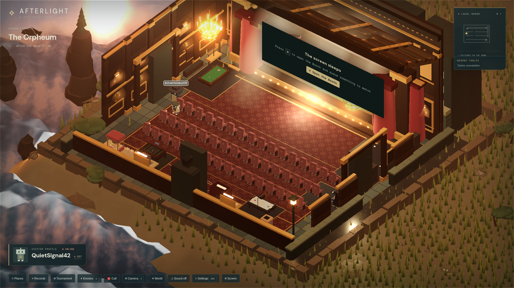
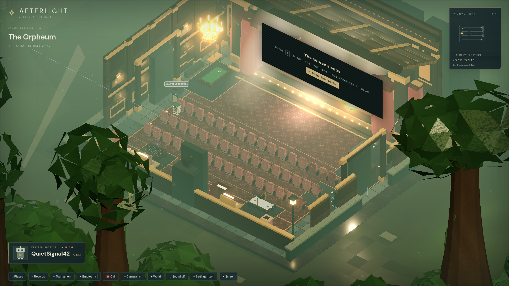
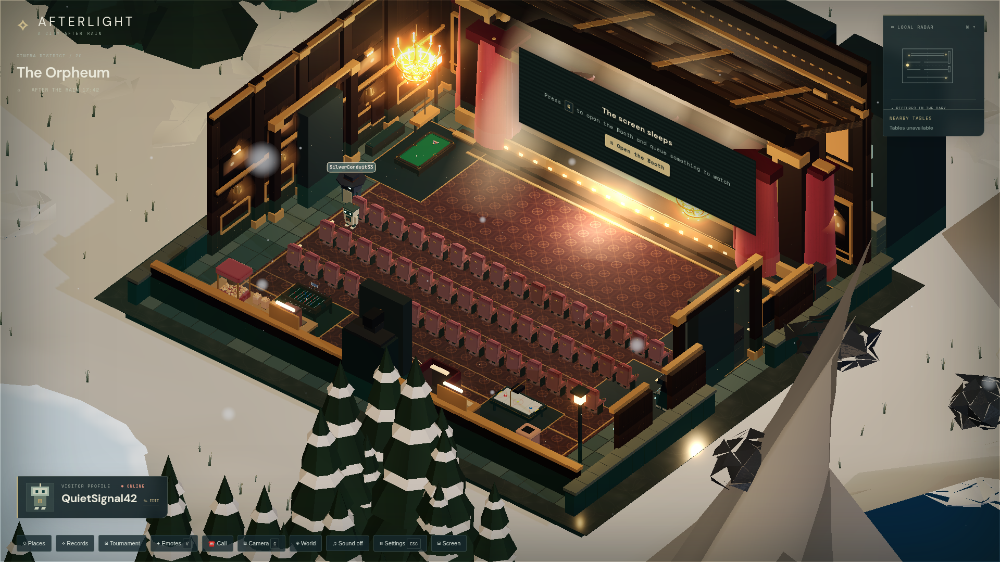
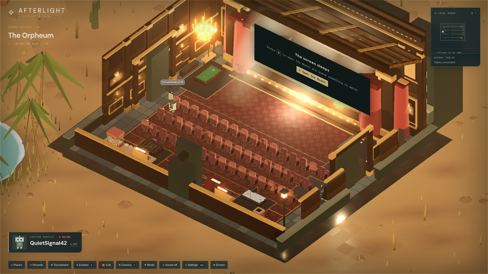
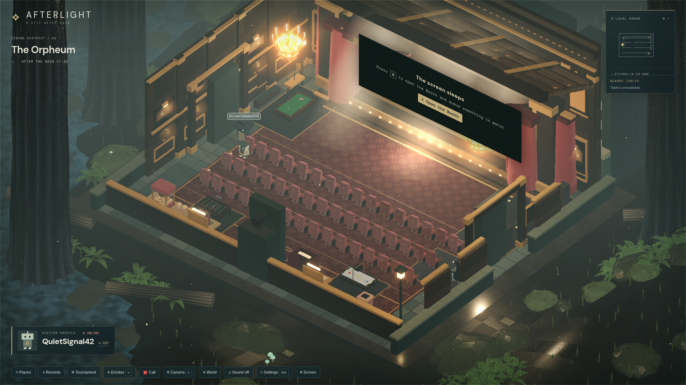
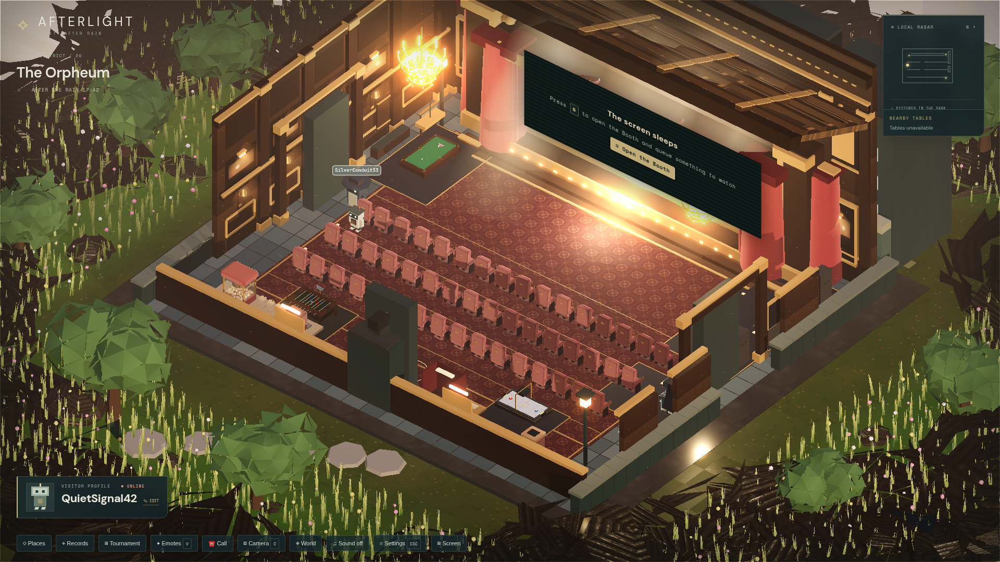

# Afterlight

Afterlight is a collection of beautiful shared places on the internet: a quiet, rain-soaked city where you wake up inside **The Orpheum** cinema, watch and play together with whoever is around, and wander from place to place — sit, chat, emote, run the projector. You are a small rust/gold maintenance robot, accompanied by **Kiln**; exploration, companionship, little discoveries and visible acts of restoration are the experience.

**Accepted destinations today:** The Orpheum (`theater`), The Rain Court (`court`), The Desert Camp (`desert-camp`) and The High Awnings (`rooftops`) — listed first in the **Places** selector (<kbd>T</kbd>). The sixteen legacy districts and the Market Court remain reachable under "Legacy areas" and through their deep links.

The original market-garden life — planting, trading, restoration landmarks — has been **retired**: the garden/economy domain is gone from the game, the code and the servers. What remains is the city itself, its shared places, and the restoration landmarks of the legacy districts.

Preserves Afterlight's signature rain-soaked aesthetic: high isometric camera, layered wet paving, brick masonry, copper pipes, warm amber lanterns, drifting mist, restrained bloom, and translucent dark HUD overlays. All scenery and robot avatars are generated in code; no external 3D models or textures are required.

---

## Screenshots

### Theater Environments — Six Worlds Around The Orpheum

The Orpheum cinema (`theater`) is the central social destination of Afterlight. While the theater auditorium, arcade row, and shared screen remain constant, the surrounding world outside transforms through room-authoritative atmosphere presets. Anyone in the auditorium can select an environment from the **◈ World** picker (<kbd>World</kbd> in the footer), and every occupant follows together.

| World | District | Atmosphere & Lore |
| :--- | :--- | :--- |
| **[Coastal Dusk](#coastal-dusk)** | `COASTAL DISTRICT / 21` | *Where the light meets the water* — The Orpheum stands on a headland while the sun goes down over an open sea. |
| **[Rainforest Canopy](#rainforest-canopy)** | `CANOPY DISTRICT / 22` | *The green cathedral breathes* — Huge trees close over the Orpheum; mist drifts between the layers and water never stops falling. |
| **[Alpine Aurora](#alpine-aurora)** | `ALPINE DISTRICT / 23` | *Cold light over the snow* — Snow peaks and a frozen basin; the aurora moves above while the Orpheum burns warm. |
| **[Desert Oasis](#desert-oasis)** | `DUNE DISTRICT / 24` | *Stone and light and a long horizon* — Mesas rise over the Orpheum; palms and still water gather at the spring. |
| **[Ancient Redwood Forest](#ancient-redwood-forest)** | `OLD GROWTH DISTRICT / 25` | *The quiet between giants* — Trunks wider than rooms rise past the roofline; the Orpheum is small, warm and ancient too. |
| **[Cloud Garden](#cloud-garden)** | `SKY GARDEN DISTRICT / 26` | *An island in an ocean of cloud* — Grass and flowers on floating stone, high above a cloud sea that never ends. |

#### Coastal Dusk
*The Orpheum stands on a headland while the sun goes down over an open sea.*


#### Rainforest Canopy
*Huge trees close over the Orpheum; mist drifts between the layers and water never stops falling.*


#### Alpine Aurora
*Snow peaks and a frozen basin; the aurora moves above while the Orpheum burns warm.*


#### Desert Oasis
*Mesas rise over the Orpheum; palms and still water gather at the spring.*


#### Ancient Redwood Forest
*Trunks wider than rooms rise past the roofline; the Orpheum is small, warm and ancient too.*


#### Cloud Garden
*Grass and flowers on floating stone, high above a cloud sea that never ends.*


---

## Getting Started

### 1. Install Dependencies

```sh
npm install
```

### 2. Start the Multiplayer Server & Client

**Supported stack (Phoenix gateway + Node sidecar):**

Prerequisites: PostgreSQL on `localhost:5433`, Elixir toolchain (`server_elixir/README.md`).

```sh
# One command — Node sidecar :3001, Phoenix gateway :4000, Vite :5173
npm run dev:stack
```

Or three terminals manually:

```sh
npm run server           # terminal 1 — torrent/IRC HTTP + transitional WS relay
npm run server:elixir    # terminal 2 — Phoenix gateway on :4000
npm run dev:phoenix      # terminal 3 — Vite with VITE_TRANSPORT=phoenix (.env.development)
```

**Legacy Node-only transport (deprecated — removal 2026-12-01):**

```sh
npm run server   # terminal 1
npm run dev      # terminal 2 — direct ws://localhost:3001/ws
```

Setting `VITE_TRANSPORT=node` or `AFTERLIGHT_WORLD_OWNER=node` emits startup warnings; prefer `npm run dev:stack`.

P11 verification (not part of `npm test`):

```sh
npm run verify:gateway
npm run verify:world
npm run verify:chat
npm run verify:p11          # composed sweep + snapshot hash check
npm run p11:snapshot-hashes # forensic hashes for data/*.json snapshots
```

Theater streaming verification (after any gateway/theater/sidecar change):

```sh
node scripts/theater-streaming-smoke.mjs   # WS-level pass over the live stack
```

…plus the real-browser checklist in `scripts/theater-streaming-pass.md` — a connected browser is the only proof that the screen actually plays.

Open **http://localhost:5173** in one or more browser windows. You wake up inside **The Orpheum**, the city's cinema, in cinema view: the shared screen on stage with the town chat docked beside it. Press <kbd>Esc</kbd> (or a movement key) to step into the aisles, then travel — walk out of the gates, or press <kbd>T</kbd> and pick any place. The Market Court and the sixteen legacy districts are all still out there. When multiple players connect, they see each other with overhead nickname tags, custom procedural robot avatars, and synchronized movement. (`?room=market`, `?room=theater`, or any place id in the URL overrides the spawn point.)

### 3. Production Build & Tests

- `npm test`: Runs the automated test suite (multi-client presence and room partitioning, movement/jump/camera math, the embedded IRC relay/bridge over real sockets, place definitions/travel, districts and restoration, the Orpheum screen/torrent/IPTV model, arcade activities, and the retained identity/HUD behavior).
- `npm run build`: Bundles the client for production into `dist/`.
- `npm run preview`: Serves the production build.

### Production deploy

```sh
npm run deploy           # backend (remote VM) + frontend (Vercel)
npm run deploy:backend   # VM only
npm run deploy:frontend  # Vercel only
```

Live URLs: **https://game-beige-pi.vercel.app** (client) → **<PRODUCTION_WS_URL>** (Phoenix gateway). Agent runbook: `AGENTS.md` § Production deployment.

---

## The city, restored (retained landmarks)

The shared places are the game's identity. The legacy districts keep their own quiet stories: each one has a field note to read and one restoration landmark to wake — a sluice valve, a signal beacon, the Orpheum projector, and more. They are optional, permanent, and stored in your local save (`afterlight-save`). There is no farming, trading or crafting loop anymore: no gardens, no coins, no market. The Market Court remains as a quiet square where the city's paths meet.

---

## Controls

| Key / Action | Function |
| --- | --- |
| <kbd>W</kbd> <kbd>A</kbd> <kbd>S</kbd> <kbd>D</kbd> / Arrows | Move relative to camera (in first person: relative to your view) |
| Click / Tap ground | Walk to location |
| Drag on the world | Turn your view (first person fallback; see Mouse look below) |
| <kbd>Shift</kbd> | Run |
| <kbd>Space</kbd> | Jump — hold it to bunny hop: chained hops keep your momentum and build speed (up to ~1.5× run) as long as the chain lasts. Obstacles still block mid-air. |
| <kbd>E</kbd> | Contextual interact with the nearest gate, seat, arcade table, landmark, or field note |
| <kbd>T</kbd> / **Travel** | Open the **Places** selector — featured destinations first, every legacy area retained under "Legacy areas"; live occupancy counts where the server can answer ("—" means unknown) |
| **World** | In The Orpheum: open the **World** picker — six authored environments around the same theater, each with three variants; anyone in the room may choose and every occupant follows |
| **Records** | Open the arcade **Records** dialog: your machine-local bests for each Orpheum cabinet plus the server-verified leaderboard, per rules version. Local bests are labeled **Pending** until the arcade's own referee records them — and **Unrecorded** if recording failed — so the board never claims a score it cannot back. **Profile** shows games, wins, streaks and bests keyed to your identity (renames keep the record; guests are this-browser only). Walkovers are not counted. |
| **Tournament** | Open the Orpheum pool tournament board (also press <kbd>E</kbd> at the chalkboard by the west lounge table). Room-local four or eight players, single elimination. Check in within 60 seconds; labeled walkovers never count as played matches. No prizes, coins or XP. |
| **Pool table** | Move the pointer across the cloth to aim; press-drag and release to set power and shoot. <kbd>A</kbd>/<kbd>D</kbd> fine-tune aim, hold/release <kbd>F</kbd> to charge/shoot, and <kbd>C</kbd> cycles cue, standing, and overhead views. <kbd>Space</kbd> is inactive while playing pool. Click the cue-ball widget for spin/English. With game sound on, the table plays recorded cue, ball, cushion and pocket samples scaled to each impact plus a quiet cloth roll while balls move — everyone near the table hears the same contacts (positioned and distance-attenuated from your own view), and it follows your Sound/effects settings without touching any stream playing on the Orpheum screen. |
| Hold <kbd>V</kbd> | Emote wheel: move the pointer outward, release V to perform. Center / Esc cancels. 1–6 or arrows select; Enter confirms. Click **Emotes** for touch / click selection. |
| <kbd>G</kbd> | In The Orpheum: open the projection booth (screen controls, IPTV lists, channel guide) |
| <kbd>Enter</kbd> / <kbd>/</kbd> | Open town chat (type & <kbd>Enter</kbd> to send, <kbd>Esc</kbd> to return to the game) |
| <kbd>C</kbd> | Cycle camera views: three isometric angles, then first person |
| Mouse Wheel | Zoom in / out (isometric views only) |
| <kbd>Escape</kbd> | Journal & Settings (in cinema view: return to the game first) |

**Profile.** Your header profile shows your nickname and connection state; the ✎ Edit control opens a nickname-only **Visitor Pass**. Player names are generated from an industrial/afterlight word bank (e.g. `CopperLantern42`, `RustCompass17`) and can be changed at any time — no coins, levels or inventory.

**Emotes.** Wave, Rust shuffle, Cheer, Much love, Bow, and Shrug animate your character for nearby players. Movement or jumping ends the pose. The wheel stops your walk target; it never pauses other players. Emotes also work seated, and leaving cinema view to choose keeps your seat.

**First person.** The fourth camera view puts you at street level. Your own avatar steps out of sight (Kiln and everyone else stay put), WASD moves relative to where you look, and your view locks the pointer and hides the cursor so you can freely look around without the mouse hitting screen edges. Press <kbd>Escape</kbd> or open a dialog to release the pointer and restore your cursor; click the game view again to re-lock. A plain click still walks, and a held drag never does. Prefer the old control? **Settings → Mouse look** switches back to press-and-drag to look (touch always uses drag). Sit in a theater seat in first person to watch the shared screen from your own chair; your view choice is local and resets to the default angle on reload, and the mouse-look setting is remembered per browser.

**Sound.** The world starts **quiet**: sound is off until you press the **♫ Sound** footer toggle, which starts the ambience and effects. Footsteps and ambient weather are synthesized in the browser; the billiards table carries a small set of recorded samples (cue tip, resin balls, rubber cushions, pocket drops, rolling cloth — about 0.5 MB, fetched once when you first play with sound on). The switch is the master volume for the whole game — with sound off, screens in The Orpheum stay silent too, and pressing it brings their picture's audio back at your chosen theater volume. Footsteps follow your walking and running cadence; their volume lives in **Settings** (<kbd>Esc</kbd> → Footsteps) and is remembered per browser.

**Bunny hopping.** Landing while <kbd>Space</kbd> is still held relaunches you instantly, preserving the speed you carried into the air and adding a little more each clean hop, up to a cap. Break the chain — release Space, stop moving, sit, travel, or pause — and you're back to normal walk/run speed. Kiln keeps pattering along on the ground and catches up when you stop.

### Town Chat & IRC

Afterlight shares one live **town channel** (`#afterlight`) panel in the lower-right HUD. The channel is global — everyone in every district and room shares it; it is not private room conversation:

- Press <kbd>Enter</kbd> (or <kbd>/</kbd>) to speak; press <kbd>Esc</kbd> to hand the keyboard back to the game. Typing never moves your robot.
- `/msg <name> <text>` whispers directly to another player or an IRC user/bot by nickname; `/me <action>` sends an action line; `/help` lists commands.
- When the panel is collapsed, a small unread counter shows what you missed; recent history is delivered on connect.
- The panel scales with your display on wide screens, and can be resized: drag the corner grip on its top-left edge, focus the grip and use the arrow keys, or double-click it to reset. Your size is remembered.

#### Connecting to the IRC server

The game server embeds a real IRC server, and the town channel is bridged onto it: what players type in the HUD appears in the channel, and what IRC users and bots say appears in the game. Connect from any mainstream IRC client over plain TCP:

| Setting | Value |
| --- | --- |
| Host | The machine running `npm run server` |
| Port | `6667` (configurable — see below) |
| Channel | `#afterlight` (created automatically; any other `#channel` works too) |
| Password / TLS | None — no server password, no TLS, no account services |

**irssi**

```sh
irssi -c localhost -p 6667 -n KilnBot
# then: /join #afterlight
```

**WeeChat**

```
/server add afterlight localhost/6667
/connect afterlight
/join #afterlight
```

**HexChat / mIRC** — add a network whose server is `localhost/6667` (no login method, no password), connect, then join `#afterlight`.

**Raw TCP (bots & scripts)** — send CRLF-terminated lines. The server sends its welcome (`001`) once it has seen both `NICK` and `USER`; only then will `JOIN` work:

```
NICK KilnBot
USER kiln 0 * :Kiln, the companion
JOIN #afterlight
PRIVMSG #afterlight :Good evening, town.
```

Once connected you can chat with players in the channel, `/msg` them by nickname (whispers bridge both ways, players and IRC users alike), and set topics. A `/me` action (CTCP `ACTION`) reaches the game as a styled action line. The server understands `NICK USER JOIN PART TOPIC NAMES PRIVMSG PING PONG QUIT WHO WHOIS OPER CAP`; `MODE` is accepted and ignored — there are no channel modes, bans, or services. Registration closes with a short message of the day (`375`/`372`/`376`), so bots that auto-join only at end-of-MOTD work unchanged. Handwritten bots should answer the server's `PING` with `PONG` (real clients do this automatically) or be dropped as timed out, and keep traffic under roughly a dozen lines per 5 seconds.

Notes:

- Online players hold their nicknames on the relay, so bots cannot impersonate them; if a player's name collides with an IRC client's, the player gets a derived handle like `Kiln_` (announced in their chat panel).
- Players see IRC users join/part as system lines, and CTCP actions (`/me`) arrive as styled action lines.
- Configuration (environment variables, read when the server starts): `IRC_PORT` (default `6667`; `0` = pick a free port automatically, logged at startup), `IRC_DISABLED=1` (in-game chat only, no IRC door), `IRC_OPER_NAME` / `IRC_OPER_PASS` (IRC operator login via `/OPER` — enabled only when a password is configured), `IRC_TOPIC` (default topic for `#afterlight`).
- Deployment note: hosted builds often only expose HTTPS/WebSocket. For external bots to reach the relay, forward or tunnel the IRC port yourself (e.g. via SSH or your tunnel of choice); in-game chat needs no external access.

---

## Legacy districts & restoration

Beyond the Market Court, Afterlight retains **16 distinct explorable atmospheric districts** representing diverse industrial, subterranean, aquatic, and alpine biomes. They are the city's history — every one still walkable, listed under "Legacy areas" in the Places selector. Players explore accompanied by **Kiln**, the cream-colored maintenance robot companion.

Each biome features:
- **Procedural 3D Architecture**: Unique materials, masonry, props, and ambient color palettes batched with `THREE.InstancedMesh`.
- **Atmospheric Visuals**: Custom fog, sunlight colors, and active animations (steam flues, flowing sluice gates, pulsing mycelium, spinning anemometers, glowing hearths, and swaying cattails).
- **Field Notes**: Poetic lore plaques and journals offering quiet environmental storytelling.
- **Landmark Restoration**: Interactive landmarks that awaken sectors permanently, updating persistent save data (`afterlight-save`) and lighting indicators.
- **Minimap Schematics**: Custom vector floor plan radar schematics on the local HUD.

### The 16 Districts & Biomes:
1. **The Rain Court** (`court`): Wet stone and warm windows where the journey began.
2. **The Sluiceworks** (`canal`): Aqueduct channels crossed by an arched bridge.
3. **The Last Platform** (`station`): Abandoned tram station with an operable signal beacon.
4. **The Sunken Aqueduct** (`aqueduct`): Subterranean cisterns and dripping limestone conduits.
5. **The Boiler Caldera** (`caldera`): Basalt fissures, sulfur crusts, and geothermal steam flues.
6. **The Spore Understory** (`understory`): Luminous mycelial forest with giant glowing shelf fungi.
7. **The Bleached Saltworks** (`saltworks`): Crystalline brine evaporation terraces and wind pumps.
8. **The High Awnings** (`rooftops`): Windward scaffolding, zinc gables, and spinning anemometers.
9. **The Brackish Basin** (`mangrove`): Flooded masonry, stilt boardwalks, and tidal weirs.
10. **The Overgrown Trestle** (`trestle`): Ancient iron railway viaduct gripped by canopy roots.
11. **The Rustfall Foundry** (`foundry`): Red iron dust, blast furnaces, and crucible hearths.
12. **The Glacial Glasshouse** (`frost-spire`): Shattered alpine conservatory with solar collectors.
13. **The Reclaimed Marshes** (`delta`): Silt sandbars, cattails, and tidal channel beacons.
14. **The Paper Catacombs** (`archives`): Sunken stone library holding centuries of preserved records.
15. **The Solar Kiln** (`kiln-terrace`): Terracotta tile courtyards and parabolic sun concentrators.
16. **The Orpheum** (`theater`): A velvet-seated cinema where the city watches together — see below.

Travel between districts seamlessly via physical east/west gateway conduits, or open the **Places** selector (<kbd>T</kbd> or the **Travel** button in the footer) and pick any destination — featured social places are listed first, and all sixteen districts and the Market Court are retained under "Legacy areas". Cards show a live occupancy count where the server can answer; "—" means the count is unknown, never a guess.

---

## The Orpheum — Watch Together

At the far east end of the line sits **The Orpheum** (`theater`), a grand old cinema where everyone in the room watches one shared screen — and where every player wakes up. What plays there plays for **everyone at once**: one player queues a film or flips an IPTV channel and the whole auditorium sees it.

The auditorium has rounded burgundy seats with padded headrests, armrests and cup holders, carpeted aisles, acoustic wall panels and speakers. At the back, a walnut concession counter holds a glass popcorn warmer and soda fountain. These furnishings are scenery; seat and projector controls work as before.

### Six worlds around the stage

The Orpheum's surroundings are the room's shared world, not a private display setting. Press **◈ World** in the footer (shown in The Orpheum) to open the picker: **Coastal Dusk**, **Rainforest Canopy**, **Alpine Aurora**, **Desert Oasis**, **Ancient Redwood Forest**, and **Cloud Garden** — each with three authored variants (sunset, storm, bioluminescent midnight, morning mist, snowfall, starry night…). Anyone in the room may choose; the accepted world is the room's atmosphere state, so every occupant follows around the same theater — the building, seats, screen, arcade and seating never move or reset, and your own pick previews immediately even while offline. Ambience follows the chosen world (rain, wind, shelter, lowpass), ducking under shared media and calls as always. See [Screenshots](#screenshots) for captures of every environment, and `docs/theater-environments.md` for design/authoring reference.

### The arcade wall

Along the auditorium's east wall stands a row of arcade cabinets — **Pong** (two players), **Rain Runner**, **Downhill Mayhem** and **Kart Royale** — plus, in its own floodlit bay just south of the travel gate, **Summit Run**, a 1–8 rider multiplayer snowboard race on the Alpine Rush course. Each machine has its own marquee art, trim lighting and controls. Walk up and press <kbd>E</kbd> to play or queue; anyone nearby can watch the screen and wait for a slot. Your best runs on the classic machines are kept in the **Records** dialog. (Signal Lost's cabinet is dormant — the game, definition and tests remain, but it has no place on the row until a future manifest edit.)

The west lounge has pool, air hockey and foosball. A chalkboard next to the pool table is the **Tournament** board: enroll four or eight players in this room, check in, and follow a single-elimination bracket. Walkovers are labeled and never counted as played matches.

**Kart Royale** is the full kart racer living in `games/kart-royale`, playable right inside the Theater: press <kbd>E</kbd> at the machine, the game loads on demand (cancellable — <kbd>E</kbd> or <kbd>ESC</kbd> backs out), and you drop onto the roster select of a complete single-player race against seven AI drivers on the Sunset Bay circuit: three laps, drift with <kbd>SHIFT</kbd> to charge mini-turbos, fire items with <kbd>SPACE</kbd>/<kbd>E</kbd>, look back with <kbd>Q</kbd>, and race for the podium. <kbd>ESC</kbd> pauses (Resume / Controls / Restart race / **Leave cabinet**); the results screen offers **Race again** or **Back to the arcade**. The machine is yours while you race — a second player queues and takes the seat when you leave — and the Theater keeps running around you: chat stays open and everyone else sees you at the cabinet. Note that while racing, <kbd>E</kbd> fires your item instead of interacting with the world.

While you explore the Orpheum, Kart Royale may prefetch its controller module and warm world resources in the background when the Theater frame budget allows (disable with `?kartPrep=0` or `localStorage afterlight-kart-prep-v1 = 0`). Leaving the cabinet normally retains the prepared race for about a minute so a quick return is faster; travel away from the Theater or a full page reload clears that cache.

Summit Run loads its mountain on demand (cancellable), seats everyone at the same cabinet, and starts a race when all seated riders explicitly ready up — no AI, no browser host, and riding solo is a first-class path (one ready rider drops in alone). One rider disconnecting never ends the race for the others. The course is the daylight **Alpine Rush** descent: carve with <kbd>A</kbd>/<kbd>D</kbd>, hold <kbd>SPACE</kbd> to charge a jump (tuck + full charge for a super pop), hold or tap <kbd>Q</kbd>/<kbd>E</kbd>/<kbd>X</kbd> for spins, grabs and flips, ride the cyan speed lanes into the lime-lipped ramps, chain tricks for combos and boost (<kbd>B</kbd>), spend boost for speed, tuck (<kbd>SHIFT</kbd>) and lean (<kbd>W</kbd>) for aero, brake with <kbd>S</kbd>, collect the yellow crystals, and bail if you land mid-trick. <kbd>R</kbd> readies up in the lobby and votes rematch on the results screen; <kbd>ESC</kbd> exits safely. Results are session-local records only. See `docs/summit-run.md` for the full lifecycle and the operations runbook; Summit Run admission ships disabled in production and is enabled server-side with `AFTERLIGHT_SNOWBOARD_ENABLED=1` (local dev enables it automatically).

**Downhill Mayhem** is the six-rider downhill mountain-bike racer living in `games/downhill-mayhem`, hosted in the Theater from its marquee slot: press <kbd>E</kbd> at the machine and the mountain loads on demand (cancellable), then you take a seat in a shared lobby. Humans fill the field first and server-run AI fill it to six, so riding solo is a first-class path — a lone ready rider drops in against five rivals. Pedal with <kbd>W</kbd>/<kbd>↑</kbd>, brake (or backflip in the air) with <kbd>S</kbd>/<kbd>↓</kbd>, steer with <kbd>A</kbd>/<kbd>D</kbd>, hop with <kbd>SPACE</kbd>, and trick with <kbd>Z</kbd>/<kbd>X</kbd>/<kbd>C</kbd> to charge boost (<kbd>SHIFT</kbd>). Combat is server-resolved: <kbd>E</kbd> punches and <kbd>F</kbd> kicks a nearby rider — including mid-air. <kbd>R</kbd> readies up in the lobby and votes rematch on the results screen; leave with <kbd>ESC</kbd>, <kbd>BACKSPACE</kbd> or the Exit button (never <kbd>E</kbd> — that's the punch). Pick **Classic**, **Timberline**, **Rockgarden** or the date-seeded **Daily**, and **Chill**/**Mayhem**/**Brutal** difficulty in the lobby. Results are session-local; a disconnected rider keeps a 30-second reconnect grace, then DNFs while everyone else keeps racing. Downhill Mayhem admission ships disabled in production and is enabled server-side with `AFTERLIGHT_DOWNHILL_MAYHEM_ENABLED=1` (local dev enables it automatically). See `docs/downhill-mayhem.md` for the full lifecycle, provenance and the operations runbook.

**Keep watching while you play.** When something is on the Orpheum screen and you walk up to any machine — Pool, air hockey, foosball, a classic cabinet, Kart Royale, Summit Run or Downhill Mayhem — the stream comes along as a small floating player in the corner, so a film never has to stop for a game. It starts muted for the game (*entry mute*); one press on the speaker icon — whose tooltip and screen-reader name read **Turn on sound and unmute stream** when app Sound or the media volume is off — restores the audio, and that explicit choice stays in effect when you leave. A compact icon strip sits under the stream: hide (a small **▸ Stream** chip brings it back), enlarge/reduce, and the **⠿** move handle (arrow keys nudge it; press <kbd>Enter</kbd> on the handle for **Reset position**). It never restarts, re-buffers, seeks, or opens a second connection. It keeps clear of chat, the interact button and each game's own HUD, falling back to a smaller player or the restore chip when space runs out. Providers without a reliable mute API (Twitch clips and degraded embeds) say so plainly and leave audio to their own player controls. **Settings → Fullscreen** fills the whole window so gameplay, the floating stream and dialogs stay together — a provider player's own fullscreen button is outside that combined mode. Operators can disable floating media with `?floating-media=off` or `localStorage afterlight-floating-media = off`; the screen then stays on the wall as before.

### Watching

- **Cinema view is the default here.** Spawning in (or walking into) The Orpheum starts the big-screen presentation: stage + docked chat, HUD aside. <kbd>Esc</kbd>, any movement key, a walk-click, or the watch bar's **⤺** action steps you back into the aisles without losing your spot — walk out the gates to play, come back and the picture is waiting.
- **Take a seat** — press <kbd>E</kbd> at any chair to settle in; the watch bar becomes **⤺ Stand up**. Standing up is one action, always reachable.
- **Run the projector** — press <kbd>G</kbd>, use the **▣ Booth** button, or interact with the screen to open the projection booth: queue, transport controls, IPTV, and volume. Works from the aisles and from your cinema seat. Anyone in the auditorium may run it; there is no host. Leave it with the footer button, <kbd>Esc</kbd>, or a click anywhere outside the panel. Queued YouTube videos show their **real titles** in the booth (looked up from YouTube in the background) instead of a generic "A YouTube video" label.
- **If your browser blocks playback**, your screen shows a **▶ Tap to start** control — tap it to join the shared film at the current point. It only affects your own view and never changes what the room is watching. A booth action the server refuses shows its reason right below the URL field, so a rejected add or play-now is never silent.
- **Restore the projector** (landmark) to light the marquee and aisle lamps for good. It's a flourish — the screen plays with or without it.

### What the screen plays

- **YouTube** videos (watch links, `youtu.be`, Shorts), **Vimeo** videos
- **YouTube playlists** (`youtube.com/playlist?list=…`) — see "Playlist night" below
- **Twitch** live channels (`twitch.tv/<channel>`), VODs (`twitch.tv/videos/<id>`), and clips (`clips.twitch.tv/<slug>`) — see "Twitch night" below
- **Direct video files** (`.mp4`, `.webm`, …) and **HLS streams** (`.m3u8`)
- **Torrent magnets** (`magnet:?xt=urn:btih:…`) — see below
- **IPTV**: add M3U/M3U8 playlists by pasting text, uploading a file, or fetching a URL — they land in the theater's **shared library**, so everyone in the room can browse them (see below). Browse channels in the **guide** — pick a **country** from the dropdown first, then narrow by that country's **categories** — and flip with **◂ / ▸**.

### The shared channel library & program guide

Playlists and the program guide are **uploads that persist on the game server** — nothing ships with the game, and the library starts empty until someone adds a list.

- **One player adds a playlist; the whole room gets it.** Anything added in the booth is parsed on the server and appears in everyone's guide — no import of your own needed to browse, tune, or flip. Server-side fetching also means playlist URLs work even when the host sends no CORS headers.
- **The guide can show "now / next".** Upload an XMLTV program guide (`.epg` / `.xml`, plain or `.gz`) in the booth and channels matched by `tvg-id` (or name) show the current and next programme in your local time, kept current while the guide is open. Uploading a new guide replaces the old one and never interrupts the screen.
- **Personal lists stay personal.** Lists saved in your browser remain a private fallback; select one and press **Add to theater** to share it with the room.
- **Communal shelves.** Anyone in the auditorium may remove a shared list; removing one never interrupts what's playing. The library and guide survive server restarts (`data/iptv.json`, `data/epg.json` — original snapshot files, never deleted or reset by the game; removing a list from the booth is the way to clean up). Generous size caps apply (24 lists, 20,000 channels each, 64 MB guides).
- Try it with a big real-world playlist and guide — e.g. the files in `~/Code/iptv/out/` (`master.m3u8` ≈ 12k channels, `guide.epg.gz` ≈ 56k programmes).

### Playlist night (YouTube playlists)

Paste a playlist link in the booth and the projector reads it for you: the game server fetches the public playlist and shows you a **preview** — title, video count, the first few titles — and one button brings its videos to the reel **together, in playlist order**, for the whole room. Nothing is shared until you confirm; closing the preview leaves the bill untouched.

- A link that carries **both a video and a playlist** (`watch?v=…&list=…`) asks every time: **Import the playlist** or **Add just this video**.
- The reel fills what it can: if the queue can't take everything, you're told exactly how many were queued and how many didn't fit.
- **Radio mixes never end**, so mix links (`list=RD…`) can't be imported — the video in the link can still be added. Private or deleted playlists are declined with a clear message.

### Twitch night (live channels, VODs, clips)

Paste a Twitch link in the booth and the projector plays it for the whole room through Twitch's official embed, like any other link.

- **A channel link plays live.** Everyone attaches to the live edge; the shared clock has no position to seek to, so the booth's −30s/+30s buttons are off. If the channel goes offline, Twitch's offline card shows and the item keeps its place on the bill; when the broadcast ends, the reel moves on.
- **A VOD link behaves like a video.** It plays on the shared clock: joining starts at the room's position, pause and seek move everyone together, and it auto-advances at the end.
- **A clip is a short insert.** Twitch's clip player exposes no remote control, so the room can't pause or seek it; the booth marks it **not synchronized** and offers **Skip**. If nobody skips, the projector advances it after a minute (Twitch clips are at most 60 seconds), so a clip can never jam the screen.
- Links are recognized live as you type: the status line under the URL box says which kind you pasted before you add it.
- The embed is served from the hostname you are playing from (Twitch's `parent` rule), so `localhost`, preview hostnames, and the deployed site all work — use a hostname rather than a raw IP, and note Twitch requires SSL outside localhost.

### Torrent night (magnet links)

Paste a magnet link in the booth and the projector resolves it for you: the game server reaches the swarm, lists the torrent's video files, and **you pick which one plays** — only then does it start (or queue) for the whole room. Torrents often carry several films or episodes, so nothing goes on the screen until a file is chosen; closing the picker leaves the bill untouched.

- While the swarm is reached you'll see live progress ("Reaching the swarm…", percent, peers) instead of a bare spinner; seeking works even in partially downloaded files, because the server streams your chosen file with byte-range support.
- Remote **MKV/AVI** URLs pasted in the booth are accepted and, when the Phoenix server has **ffmpeg/ffprobe** installed, prepared server-side into a shared **HLS** stream (`/api/theater/media/...`) so every occupant watches the same converted output. The overlay shows *Inspecting media…* / *Preparing video…* while that runs; MP4/WebM direct links still play without conversion.
- Torrent files browsers usually can't decode (MKV, AVI) are listed with a *may not play* note; MP4/WebM and friends are offered first. Torrent bytes are not transcoded — use a direct URL for server-side MKV preparation.
- Torrent items on the bill survive reloads and server restarts — downloaded payloads are cached under `data/torrents/` (size-capped at ~4 GB, least-recently-used eviction; both tunable with `TORRENT_CACHE_DIR` and `TORRENT_CACHE_MAX_BYTES`). That downloaded-payload cache is regenerable and safe to clear; the snapshot files themselves (`data/game-state.json`, `data/iptv.json`, `data/epg.json`) are never deleted.
- **You are responsible for what you stream.** Magnets play through the server operator's connection, so only point the projector at content you have the right to watch and share.

Queue behavior: items added while something plays line up in the queue and auto-advance when a film ends (dead links are skipped with a notice). The now-playing state and queue live on the server — they survive reloads and restarts, and latecomers join mid-picture at the right moment. Playback is drift-corrected to a shared clock, so pausing or seeking moves everyone together.

### Good to know

- Only `http(s)` links and magnet links can be pinned to the screen; YouTube/Vimeo/Twitch play through their official embeds, magnets resolve through the server's torrent engine (above), and everything else plays as a plain video stream.
- Playlist imports by URL are fetched by the game server, so CORS-hostile playlist hosts work; if the server itself can't reach a URL, paste the text or upload the file instead.
- Streams their hosts remove or region-block will show a notice and skip ahead. Live channels — IPTV and Twitch — can't be rewound.
- Whether other players can *hear* a video depends on each browser's autoplay rules; a "Tap to start" badge appears if the browser needs a click first. Volume is local.

---

### Transport: Phoenix gateway + Node sidecar

The supported stack is the **Phoenix gateway** (`server_elixir/`, port 4000 in dev) owning transport, world rooms and chat relay, plus the **Node specialty sidecar** (port 3001) retaining torrent/IRC HTTP, theater uploads and transitional relay for domains not yet ported (see `docs/architecture/elixir/ownership.md` §5). `npm run dev:stack` starts both; the client picks the transport at build time (`VITE_TRANSPORT=phoenix` in `.env.development`).

- The legacy Node-only transport (`npm run dev` + `npm run server`, `VITE_TRANSPORT=node`) is **deprecated** (removal 2026-12-01); selecting it emits startup warnings.
- Environment knobs: `AFTERLIGHT_BOUNDARY_SECRET` (gateway→Node shared secret; unset = direct clients unaffected), `AFTERLIGHT_NODE_WS_URL` / `AFTERLIGHT_NODE_HTTP_URL` (loopback defaults), `AFTERLIGHT_TOKEN_SECRET` (set a real value outside dev).

---

## Architecture & Server Authority

The single authority map for every domain is [`docs/architecture/elixir/ownership.md`](docs/architecture/elixir/ownership.md) (§5 records the current retirement status per domain). In short:

- **Supported stack:** the **Phoenix gateway** (`server_elixir/`) owns transport, world rooms/presence (dev flip) and the chat relay; the **Node specialty sidecar** retains torrent/IRC HTTP, theater uploads and a transitional relay for domains not yet ported.
- **Theater & catalog:** The Orpheum's bill/timeline, playlist imports, IPTV library and EPG have live Phoenix (Ash/PostgreSQL) handlers, flipped by routing in dev; when flipped, the Node theater/catalog writers stand down and `data/iptv.json` / `data/epg.json` become read-only forensic originals.
- **Gardening removed:** the market-garden/economy/restoration domain and its `Gardener` identity were retired in full (change `remove-gardening-domain`): no cultivation, gathering, crafting, trading, coins or XP remain in the code, the wire protocol or the databases. The Market Court stays as a quiet square, and the untouched snapshots (`data/game-state.json`, `data/iptv.json`, `data/epg.json`) remain read-only forensic originals.
- **Durable persistence:** the legacy engine saves its domains atomically to `data/game-state.json`; flipped domains live in PostgreSQL. Original snapshots (`data/game-state.json`, `data/iptv.json`, `data/epg.json`) are never deleted; only the regenerable torrent payload cache may be cleared.
- **Client Interpolation**: Remote players transmit movement at ~10 Hz and interpolate smoothly without jitter.
- **Guest Identity**: Players receive an automatic persistent guest UUID and atmospheric nickname (e.g. `CopperLantern42`, `RustCompass17`), which can be customized at any time.
- **Creative Avatar System**: On first visit, every player is deterministically assigned a unique avatar persona from a roster of 24 distinct low-poly figures across `humanoid`, `humanoid-heavy`, and `floating` rigs (including *Moon Head*, *Neon Jellyfish*, *Black Hole*, *Rubber Duck Mech*, *Cassette Punk*, and more). Avatars are authoritatively assigned by the server, persistent per visitor token, and displayed in the **Visitor Pass** profile dialog (<kbd>P</kbd>). Assignment is immutable per token in v1 (no user choice menu). Each avatar features declarative, zero-allocation visual flourishes (such as CRT static, pulsing glows, spinning reels, or floating hover). For technical details and authoring guidelines, see [`docs/avatars.md`](docs/avatars.md).
