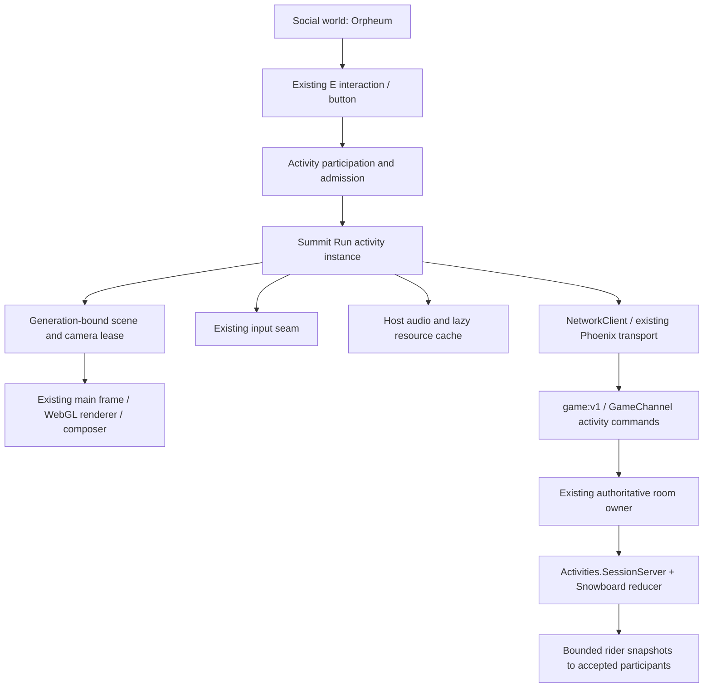
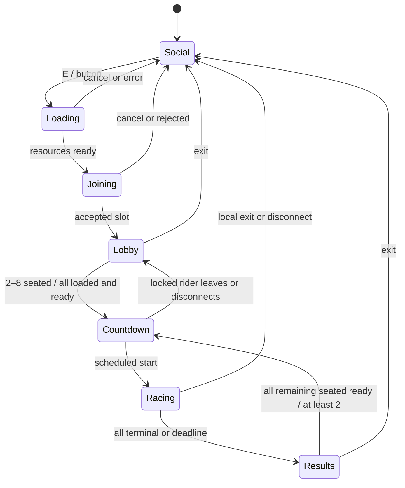

## Context

See `proposal.md` for motivation and `investigation.md` for inspected code and provenance. This design targets the dirty working tree at Afterlight commit `b6468e40a5639c41bf9c83c5d0e7cd012004d561` on 2026-09-08, including the uncommitted canonical cabinet changes. It does not assume the unfinished activities program, gardens migration or experimental GPU backend is complete.

## Goals / Non-Goals

**Goals:** one integrated, hostless 2–8 rider race; explicit contracts suitable for parallel implementation; reuse activity authority and host rendering; observable cleanup and bounded work.

**Non-goals:** a generic minigame framework, new renderer/socket/login, public world-instancing product, full rigid-body physics, durable race rankings, AI or trick scoring. Solo waits for another rider. Full 3D spectating is NICE-TO-HAVE; public progress spectating is REQUIRED. Gamepad mapping is documented but FUTURE unless added within the same tested input seam without delaying desktop.

## Decisions

### D1 — Extend the activity module, not place travel

Proposed frontend files: lightweight `src/activities/snowboard.js` registry bootstrap; lazy `src/activities/snowboard/{scene,controller,prediction,interpolation,hud,audio}.js`; pure `shared/snowboard/{rules,course}.js` and versioned numeric course data. These paths are **new**, not discovered infrastructure. Reuse `runtime.js`, `registry.js`, `participation.js`, `inputSeam.js`, `cameraSeam.js` and `compositeController.js`.

`initialize()` remains synchronous: return cabinet/update/accept/dispose hooks immediately. `prepare()` is an internal async operation started by E; hold a token `{placeGeneration, attempt}` and disposed flag. Build the scene hidden, accept resources only for current token, and dispose late results. Load first, then request play admission while still near cabinet; show cancellable loading state. If admission fails, keep a bounded cache and remain in world. A successful join starts lobby view and sends course readiness. A reconnect uses its existing leased slot rather than fresh admission.

Introduce only an optional activity-view seam, owned by `main.js`, exposed through runtime context:

- `acquireView({owner, generation, scene, camera, resize, onRelease}) -> lease` rejects a stale generation/second owner.
- `lease.release(reason)` is idempotent; only its owner can release it.
- Main resolves `renderPass.scene` and `activeCamera` together each frame. Use the existing composer, renderer, resize and RAF. The mountain scene owns its fog/lights/background; shared world actors are never reparented into it.
- Save camera preference, first-person yaw/pitch, HUD state and prior presentation. Suspend world locomotion, world-only animation/audio and hidden cabinet visual work; continue net event processing, chat and theater synchronization. Hide theater DOM homography overlay without pausing shared media. Retain social world/Kiln in memory and authoritative social-room membership.
- Resize the leased perspective camera and composer together. Disable world raycasts/click-walk/C/zoom while owned. Restore the social render pass and camera through the existing camera seam, with player visibility appropriate for first-person mode.
- Release before place travel, disposal, unsupported transport, error or disconnect; clear all held input, walk targets, jump/momentum, gestures and cached prediction. Safe dismount uses existing participation logic and current obstacles; no exact-position save feature is added.

Alternative separate app/iframe rejected: duplicates lifecycle and identity. Alternative camera-only extension rejected: existing camera seam cannot select a mountain scene. Alternative new `setRoom` destination rejected: would leave social presence/chat and break cabinet identity.

### D2 — Cabinet and world representation

Add manifest type `snowboard-race`, rulesVersion `1`, place-local ID `summit-run`, minPlayers `2`, player capacity `8`, spectator capacity `32`, queue capacity `16`, environment policy `none` (course weather frozen by course version). Extend JS validation and `scripts/export-place-definitions.mjs` / Elixir projection together. The cabinet skin remains client-only; authoritative capacity/course rules are exported.

Use existing `cabinet: {model:'upright', skin:{title:'SUMMIT RUN', tagline:'2–8 RIDERS', motif:'summit', palette:{base:'#152730',ink:'#ecf2ec',accent:'#7acbd4',glow:'#edb66c'}}, led:{color:'#7acbd4',intensity:1.5}, controls:{player1:'#edb66c',player2:'#7acbd4'}, screen:{type:'canvas'}}` shape. Add original snowy silhouette, trail map and amber lodge artwork through `src/arcade/artwork.js`; no new GLB.

Author a fifth cabinet and eight distinct safe standing anchors in `src/world/theaterWorld.js` / manifest. Exact coordinates are an art/layout task, constrained by validated bounds, existing four machines, gates, cinema seats and navigable aisles. Test reachability from spawn and all dismounts. Do not overlap eight people at the existing single-anchor fallback.

Social avatar remains anchored/frozen; Kiln stays world-side. Render a short playing label from accepted public session roster on existing nameplate UI, rather than trusting a client presence flag. Race representation is a lightweight original maintenance robot on a snowboard with nickname/profile accent, no second social presence entity. Reuse suitable procedural avatar parts only after checking ownership/disposal; do not move the player's actual shared object.

Cabinet display uses the existing CanvasTexture source (1040×720, 13:9 fitting): idle title/Press E; lobby rider count/ready count; racing live ranked progress dots and checkpoint counts; results winner and times (ties show joint winners). This is canonical progress spectating, not fake video. Update on summaries at ≤2 Hz plus immediate phase/result changes; attract ≤10 Hz, hidden/distant zero as existing policy. Full mountain render-target previews and focused chase spectating are optional follow-up; not required by v1 and must not silently add a second mountain render per frame.

### D3 — Reuse session processes, fix only the race-specific assumptions

Extend `Afterlight.Activities.SessionServer` with a narrowly scoped lifecycle dispatch for `snowboard-race`, implemented by new `Afterlight.Activities.Snowboard` pure rules and a small race lifecycle policy. Keep existing Pong/solo branches and tests unchanged. Do not introduce another supervisor hierarchy: use `Activities`, its Registry/DynamicSupervisor, owner monitoring and fencing.

Session lookup identity becomes owner-derived `{canonicalRoomKey, roomEpoch, activityId}` for snowboard; `canonicalRoomKey` is existing `{region,districtId,instanceId}` from RoomKey. Keep the real public wire `roomId` (`theater`) in existing envelopes; resolve manifest by district ID. Never construct the canonical identity from a client string. A random `sessionId` identifies the live process; a fresh `matchId` identifies each locked countdown. World instances with the same cabinet type cannot collide. Current public rooms only support instance `main`; non-main production travel is not added. Test identity isolation using two test owner instances, including owner epoch reuse/failover.

Admission reuses signed guest/profile identity, current channel connection, accepted room membership and identity reservation. Check physical proximity on initial play/queue and promotion acceptance; fail closed when membership/owner/proximity lookup fails (current generic helper catches exits too permissively). Reconnect to an existing active slot within grace revalidates identity/room but does not demand the pre-anchor pose. Duplicate connection transfers that slot and rotates lease; first accepted seq is 1.

Existing Admission registry is node-local, not a distributed identity lease. Release v1 on the current single-owner-node deployment; do not advertise cluster-wide duplicate prevention. A multi-owner-node rollout requires an explicit global admission/fencing gate before enabling this type there. This is a rollout constraint, not a newly invented distributed service.

One process per active cabinet is appropriate because it isolates simulation from social room handling and reuses cleanup/fencing. All starts and publication check the owner fence. Owner loss/process crash aborts transient race with no fabricated winner; successor session has a fresh identity and no restored in-flight physics. No browser host/party leader is needed.

### D4 — Exact lifecycle

`FINISHED` is a per-rider terminal state while others continue; `REMATCH_VOTE` is readiness displayed within results, not another server phase. Server phases: `lobby`, `countdown`, `racing`, `results`, `aborted`. Loading/joining/recovering are local only.

| Condition | Exact v1 behavior |
|---|---|
| One person | Lobby “Waiting for another rider”; Ready may be set, no solo start/AI. |
| Ready | Explicit button; no auto-ready for this type. Ready only after matching course hash loaded; expires after 60s. All seated, connected riders ready and count ≥2 locks roster and starts 3s countdown. An unready rider can intentionally wait; ready users may leave. No host override. |
| Countdown membership | Roster locked. New play request offers Watch progress / Queue next race; never drops rider into a countdown. Existing ready=false, leave or disconnect cancels countdown, returns lobby, clears all readiness. |
| Start | Server resets kinematics/checkpoints and schedules monotonic start; inputs before start update held-state only, no motion or charged jump advantage. |
| Racing late join/full | Offer watch summary and explicit FIFO queue, no player slot stealing. Queue does not capture world input. Full responses carry current counts. |
| Finish | Valid first finish starts a 30s finish grace deadline capped by the 180s overall race deadline. Finisher stops in finish area and sees results-in-progress; remaining riders keep racing. |
| All opponents leave | Remaining rider continues to valid finish; no automatic victory. Show “Others left” and record opponents DNF. If everyone quits, abort/reap. |
| Disconnect racing | Neutralize immediately when known; watchdog after 250ms otherwise. Freeze absent rider at last valid state; timer continues. Reserve slot 30s; remaining riders continue. On reconnect rotate lease, restore frozen state and elapsed time. If freeze is airborne, resume that state without elapsed-time ballistic jump. |
| Grace expired | Mark DNF once with reason `disconnect`; slot reserved in immutable current standings but admission can release. Cannot re-enter current race; may queue. |
| Explicit leave/travel | Immediate DNF for active racer and release lease; results remain for others. No waiting for network to return local controls. |
| Reload | Server disconnect grace still protects others. Client starts in social world; a sessionStorage resume hint carries only activity ID, never credentials/lease. After room acceptance offer Resume if slot still valid; otherwise ordinary lobby/queue. |
| Results/rematch | Clear ready flags; Rematch means ready=true for next match, requires loaded course and all remaining seated riders with minimum 2. No majority vote. New countdown rotates matchId and resets all transient state; keep scene/resources/socket. |
| Queue promotion | At results/lobby, offer free slot FIFO; 30s accept window, fresh membership/proximity check. No automatic teleport/focus. New seated rider begins unready. |
| Abandoned users | Ready expires at 60s. Nonready seated player after 120s without user action is released to world/watch; disconnected users follow grace instead. Results display retained 120s without user action, then return remaining viewers to world and empty/reap. No idle heartbeat counts as user action. |
| Empty session | Stop ≤60s after last reconnect grace expires. Spectators alone do not keep it alive indefinitely: send idle summary and detach them at reap. |
| Owner shutdown/restart | Stop work and invalidate session/leases. Abort banner, local view release; after room rejoin offer fresh lobby, no invented winner. |

Inputs/chat pause only local interaction; never pause the multiplayer race. Text chat and established voice/call connection continue through existing systems and room membership; preserve mute state and no new voice/chat channel. If the existing call adapter is unavailable, race still works. World proximity audio stays at the social anchor; do not claim mountain proximity voice.

### D5 — Small authoritative kinematics, with client prediction

Decision: run a bounded 2.5D course model in BEAM, not arbitrary client transforms or a full rigid-body world. SSXTricky already uses progress/lateral kinematics, making this practical. Server owns positions, jumps, obstacles, checkpoints and times. Browser mirrors the pure step for immediate local control; remote clients interpolate. This satisfies existing inputs-only activity contracts and closes trivial speed/teleport/finish forgery. Alternative client motion plus plausibility checks costs a new trust boundary and permits shortcut cheats; rejected for this bounded course. Full rigid body/worker/NIF is excessive.

Coordinate convention: course progress `s` in meters increases downhill; lateral `u` measured from centerline; world `z=-s`, `x=centerX(s)+u`, `y=height(s,u)+boardClearance`. Course length 1800m. Canonical numeric JSON contains grid samples every 2m longitudinally and 2m laterally over ±24m, centerline samples, rideable width, surface tags, ramps, obstacles and gates. Linear center interpolation and bilinear height interpolation, clamped at edges, are identical on server/client. Render terrain from those samples; cosmetic snow noise must not change contact surface. Export the same file/hash for Elixir; no separate hand-ported sine terrain.

Initial rulesVersion 1 tuning (playtest tuning before release must update golden fixtures/hash):

- Fixed `dt=1/30s`; state `{s,u,v,vu,y,vy,grounded,jumpCharge,recoveryTicks,nextCheckpoint,finishTick}` plus previous state for swept collisions.
- Course tangent downhill grade `gSlope=clamp(-dHeight/ds,0,0.6)` from the same samples. Ground acceleration `a=9.81*gSlope + (tuck?4:1.5) - 0.006*v*v - (brake?12:0) - (shoulder?6:0)`, speed clamped `[0,45]`m/s, initial start speed 8m/s. No boost inventory/trick bonus. This is arcade tuning, not real snow friction.
- Desired lateral velocity `steer*(tuck?7:10)`m/s; approach with fixed factor `min(1,8*dt)` grounded, `min(1,2*dt)` airborne. Carve drag `abs(steer)*1.5`m/s²; update speed before progress, then `u+=vu*dt`. Grounded board orientation follows sampled normal and steering roll; orientation visuals do not affect authority.
- Legal corridor ±24m, normal groomed ±18m. Shoulder penalty above applies outside ±18m. Clamp at ±24m, zero outward lateral velocity, apply one 20% speed loss on boundary impact with 0.5s cooldown; no repeated every-frame damage.
- Space held on ground charges to 1 over 0.75s; release launches `vy=7+6*charge`m/s plus current ground vertical tangent speed; gravity 20m/s², reduced air steering. No double-jump; cancel charge on neutralization/blur, crash and reset. Two authored ramp lip gates add 3m/s once per forward crossing if grounded (or initiate launch with base 7 if not charging). Track crossed ramp ID to prevent repeat abuse.
- Air integrates `vy-=20*dt`, `y+=vy*dt`; landing is swept downward crossing of current ground. Snap to surface and project velocity; impact normal speed >16m/s triggers crash. Obstacles use swept rider capsule radius 0.6m against bounded boxes, preventing tunneling; racer-racer collision is disabled.
- Crash: 0.75s recovery, speed reset to 8m/s, zero lateral/charge; reposition to a course-authored safe recovery point behind obstacle on the same checkpoint segment. Never reset beyond an unearned gate. No life counter/elimination; race continues. Track crashes as session feedback only.
- Neutral controls use steer=0, tuck=false, brake=true and cancel charge. Known disconnect freezes kinematics as D4; connected input starvation uses neutral braking. Reconnect/pause cannot reset progress or clock.

Evaluation order is input/watchdog → recovery or motion integration → boundary/obstacle swept collision → terrain contact → ordered gate crossing → terminal state. A crash step evaluates gates only along the pre-impact valid swept segment, never along recovery teleport. Bounds, course width, ramps and obstacles are finite and version-validated; cap colliders at 64 with spatial bins.

Server scheduler uses monotonic elapsed accumulator, max four catch-up steps. A transient ≤4-step backlog catches up; if remaining debt exceeds 500ms abort affected match `server_overload` rather than advance clocks while dropping competitive simulation time. Smaller debt remains in bounded accumulator. Countdown/finish/grace deadlines use monotonic server time. Fairness is casual: latency affects effective input time; no timestamp rewind supplied by clients.

### D6 — Course and authoritative results

One authored route: 0–200m lit start slope; 200–600 broad S-carves; 600–1000 pine cut with first jump; 1000–1400 wider ridge and second jump; 1400–1800 floodlit lodge finish. Eight full-width checkpoint planes at 200,400,600,800,1000,1200,1400,1600m, then finish 1800m. Gate vertical acceptance covers surface to +30m; lower/over-height or out-of-corridor movement is invalid. Gate beams/markers make the entire legitimate route readable; no hidden shortcut lanes. Target play duration ~60–120s, capped 180s.

The server evaluates successive previous/current valid state segments against the next gate plane, requiring positive s direction, in-corridor interpolated u and accepted altitude. Process multiple crossed gates in order within one step if necessary; no client checkpoint event exists. Gate splits use simulation tick and crossing fraction. Finish requires all eight gates. Finish elapsed is `(tickIndex + fraction) * 1000/30` from scheduled GO, rounded for millisecond display; compute with monotonic tick identity, never client clock or packet arrival. Sort exact finish keys; differences below 1ms display tied place, stable slot order only for rendering, shared winner if first tied. DNF sorts after finishes by last checkpoint then progress, labeled DNF without a fake time. Duplicate terminal calculation is idempotent by matchId/player.

Results are session-local, bounded to the latest match plus current match; no global record/personal-best database claim. Existing `Results`/`ActivityMatch` support Pong/solo scores, not a race placement table. Do not shoehorn timings into score rankings. The generic durable-completion rule still forbids unvalidated results; durable snowboard ranking is explicitly outside this release and must be reconciled as such with the parent activities program during archive. UI shows place/name/time/DNF and rematch readiness; splits/crashes may appear in a detail row only if cheap, no leaderboard menu.

### D7 — Protocol and rates

Use the existing Phoenix socket and `game:v1` topic with existing `activity_*` names. No `snowboard:*` channel. Advertise new supported type/rules version only when the backend feature flag is enabled. Do not claim the generic activity protocol alone implies snowboard support.

Shared response header `H`: `{type,version:1,roomId,roomEpoch,activityId,sessionId,revision,serverNow}`; preserve existing top-level `status,matchId,players,queueLength,spectatorCount` and nested state shape. `revision` advances lifecycle changes, so use added `serverTick`/`snapshotSeq` for motion ordering. IDs ≤64 chars; seq starts 1 and is scoped to rotated participant lease.

Snowboard mutation fence `F`: `{activityId,roomEpoch,sessionId,matchId,lease}`. Require F on ready/input/leave and any queue acceptance after admission; join initially has no lease and is authorized from channel context. Lease fields never appear in room/public snapshots. Pre-accept cancellation uses requestId, bound to the original channel connection; delayed cancel cannot release a newer lease. Additive F fields must be retained by validators, not silently stripped. Preserve legacy activity behavior outside snowboard.

| Client command | Exact snowboard payload / semantics |
|---|---|
| `activity_join` | `{requestId,activityId:'summit-run',role:'play'|'watch'|'queue'}`; identity/room supplied only by authenticated channel. Loaded scene precedes play request. Reconnect joins same identity slot. |
| `activity_input` load handshake | `{...F,seq,controls:{kind:'loaded',courseId:'summit-night',courseVersion:1,courseHash}}`; accepted only lobby/results or reconnect, exact server hash. |
| `activity_ready` | `{...F,requestId,ready:boolean}`; only loaded seated player, lobby/results; during countdown false cancels. Results true is rematch vote. |
| `activity_input` motion | `{...F,seq,controls:{kind:'ride',steer:number,tuck:boolean,brake:boolean,jumpHeld:boolean}}`; strict exact allowlist and finite steer [-1,1]. Server detects charge/release edges from accepted held states; no client dt/time/position/score. |
| `activity_input` neutral | `{...F,seq,controls:{kind:'neutral'}}`; cancel charge and brake; prioritized latest control. |
| `activity_leave` | `{...F,requestId,reason:'exit'|'travel'|'load_failed'}`; idempotent within that lease; server connection close independently releases/graces. |
| `activity_resnapshot` | `{requestId,activityId,sessionId}` existing rate limit; response snapshot matched to current accepted room. Also echo requestId/client send correlation for clock sample; does not mutate race. |

Join acceptance extends current private `{result:'seated',slot,role,lease,leaseId,sessionId,revision,status,requestId}` with roomEpoch, matchId and full baseline snapshot. Initial lobby has a nonempty matchId; every locked countdown rotates it. Both `lease` and legacy `leaseId` aliases may be returned for compatibility, but only one canonical value. Watch/queue acknowledgement issues a scoped control lease if their leave/offer actions need it, never a play input lease.

Snapshot `activity_state` carries H plus `{status,matchId,snapshotSeq,serverTick,startAt,courseId,courseVersion,courseHash,deadlineAt,state:{players:[{playerId,nickname,accent,slot,connected,loaded,ready,status}],sim:{riders:[{playerId,s,u,v,vu,y,vy,grounded,jumpCharge,recoveryTicks,nextCheckpoint,splitsMs,finishMs,finishKey,dnfReason}],tick},lastAcceptedSeqs:{playerId:seq},queueLength,spectatorCount}}`. Fields unavailable before race are null/empty; nickname/accent are server-sanitized existing profile values. No raw input history or tokens broadcast. Max eight riders, eight splits each, bounded names, no full course in frames.

`activity_event`: H plus `{matchId,eventId,eventType,payload}`; types `countdown`, `checkpoint`, `rider_finished`, `rider_dnf`, `race_aborted`, `queue_offer`. Payload is respectively `{startAt}`, `{playerId,index,elapsedMs}`, `{playerId,elapsedMs,finishKey}`, `{playerId,reason}`, `{reason}`, `{expiresAt,offerId}` (offer private). Existing event aliases remain consistent. Clients dedupe by eventId; late snapshots do not replay sounds.

`activity_result`: H plus `{matchId,result:{kind:'snowboard_race',recordingStatus:'session_only',standings:[{playerId,slot,place,timeMs,status,dnfReason}],reason:'complete'|'deadline'}}`. Abort has no standings winner and is an event/state, not completed result. Current snapshot retains results so event loss is recoverable.

Errors use existing `activity_error` with requestId and typed code: reuse invalid_request, unauthorized, stale_session, stale_epoch, stale_sequence, rate_limited; add type-scoped `stale_match`, `course_mismatch`, `not_loaded`, `race_in_progress`, `server_busy`, `race_unavailable`. Errors never alter another match. Unsupported Node transport stays functional but cannot join.

30Hz local input/heartbeat (send neutral promptly), 30Hz server fixed steps, 20Hz full participant snapshots, immediate lifecycle events. Rendering stays display-rate. Existing 2KiB entire command cap, 60Hz input with burst10, 5Hz controls, resnapshot one/5s, 32KiB full snapshot and ≤20 snapshots/s are ceilings. Re-encode/check final snapshot; never merely trim events and assume it fits. Initial target rider snapshot ≤6KiB.

Do not feed high-rate race frames into existing room-wide `broadcast_frame`, which currently sends to everyone and bypasses bounded presence delivery. Add scoped bounded delivery to accepted players and optional subscribed watchers via existing channel processes. Public cabinet summary uses room-wide ≤2Hz + immediate phase update and contains only counters/progress/results. Reject excess watch/queue and slow consumers using existing retryable disconnect pattern; transport queue cap 64 pending race frames, coalesce obsolete snapshots to newest where possible, never queue unbounded state. Test with actual stalled sockets; a sampled mailbox length alone is not a complete backpressure guarantee.

### D8 — Prediction, interpolation and clock

Client predictor runs the same fixed 30Hz rules with at most four local catch-up steps; keep up to two seconds/60 control steps. Include last accepted seq per rider in snapshots. On authoritative snapshot reset predicted simulation to server state/tick, drop acknowledged controls, replay buffered newer controls under the same latest-held-state policy; seq is not a client time authority. Smooth visual correction ≤0.5m over 100ms, hard-reset >3m or any mismatch in checkpoint/recovery/grounded terminal state; intermediate errors converge over 150ms. Predicted effects are cosmetic; authoritative gate/finish events own HUD outcome. Freeze prediction after 250ms without snapshots and display reconnecting after 1s; don't continue inventing kilometers offline.

Remote buffer 100ms (two snapshots), interpolation by authoritative serverTick over position/velocity; normalized yaw derived from tangent and lateral velocity, no Euler wrap snap. Extrapolate ≤100ms then hold with connection indicator. Drop wrong epoch/session/match and nonincreasing snapshotSeq; revision equality is not a reason to drop motion. DNF/finish/reset and respawn snaps clear buffers; interpolation must not animate across recovery teleport. Include additive `resetSeq` per rider for that purpose.

Countdown uses server monotonic target internally and publishes epoch-ms `startAt` and `serverNow` for display only. Seed clock estimate from join snapshot; improve using echoed request correlation on join/ready/resnapshot with RTT midpoint, keep lowest-RTT of last eight samples, never exceed existing resnapshot rate. Convert to a `performance.now()` deadline on receipt; refresh mapping for each countdown, avoid wall-clock changes. Server starts irrespective of browser countdown; late frame jumps to current number/GO. Acceptance under 100ms RTT/20ms jitter: both browsers' displayed GO within 100ms, while authoritative start is exactly shared. Large clock uncertainty shows syncing; does not let client postpone start.

### D9 — Assets, effects, audio and loading

| Asset | Classification / location | Delivery and provenance |
|---|---|---|
| Upright cabinet GLB | Existing Afterlight, canonical public path | Shared load-once template, existing fallback/hot-swap and disposal; preserve current provenance. |
| Cabinet art | Asset to create / procedural `arcade/artwork.js` summit motif | Original Afterlight silhouette, trail-map sides, cream/ice/amber colors; lightweight startup only. |
| Course/ramps/gates | Procedural asset, new versioned numeric course data | Lazy mountain chunk; same data/hash on client and server; SSX technical inspiration only. |
| Rider/board | Asset to create, procedural robot parts and board | Existing avatar accent/name; original silhouette, no imported branded outfit. |
| Trees/lodge/lift/peaks | Procedural asset to create/adapt reference builders | Instanced/merged static meshes; source attribution to user-owned SSXTricky if code extracted. |
| Snow/spray/trail sprites | Procedural asset | One small locally generated atlas; bounded pooled Points/instanced quads, no required external texture. |
| Wind/sliding/carve/landing/countdown | Procedural synthesized audio | Host AudioContext, effect bus, gain automation; no new context per tone. |
| Music | Optional asset to source, omitted v1 default | Only documented compatible license/attribution; no SSX soundtrack. |
| SSX reference source | Reference, pinned commit in investigation | User requested reuse of their source; retain attribution and record authorization/provenance. No tracked license: do not label it MIT or redistribute third-party material without established rights. |

No external asset is required to ship. Record path, creator/source, license/authorization, modifications and attribution in proposed `docs/summit-run-assets.md`. Missing licensing for a specific optional extraction means independent procedural implementation, not a blocker or invented license.

Lazy import does not pull Next.js/React/SSX engine into Afterlight. Cache one course resources bundle across rematches/short re-entry, with reference counting; dispose on eviction after 60s unused, memory pressure or runtime teardown. No unconditional mountain prefetch at startup; optional proximity idle prefetch respects data-saver and never creates scene/AudioContext before need. Loading errors show Retry/Exit; ready disabled until all required resources/course hash match. Primitive cabinet fallback does not block play if the optional GLB fails.

Effects baseline WebGL: ≤2,000 snowfall particles, ≤256 shared spray/landing particles, bounded 128 trail segments, distance-culled instanced pines and low-detail distant peaks; no per-particle objects or per-frame materials. One shadow-casting key light or blob shadows on low preset, reuse existing bloom. GPU point rendering is sufficient; WebGPU compute/KTX2/Draco/Meshopt are not new dependencies without measured need. Future GPU backend requires parity and capability fallback, never gates basic play. Reduced-motion lowers spray/shake; low quality removes shadows/bloom/extra snowfall while retaining gates/obstacles/riders.

Chase camera adapts prototype lookahead/speed FOV (~64–76°), frame-independent smoothing, ground clearance and optional reduced motion. No mouse look required v1. W/Up or Shift tuck; A/D or Left/Right carve; S/Down brake; Space charge/release; Escape follows existing focus hierarchy and otherwise exits immediately. C/world wheel are yielded. Proposed future gamepad: left stick steer, RT tuck, LT brake, A hold/release jump, B exit; no parallel input manager.

Reuse existing chat/call DOM and settings; race HUD is compact overlay, not website layout: position/provisional label, time, checkpoint, speed; lobby ready roster; results Rematch/Exit. Avoid live-region announcements every frame: announce countdown/start/checkpoint/finish/disconnect only. Host audio integration must be injected through activity runtime because current cabinet fallback opens contexts per tone. Cap race voices at 16, stop/disconnect loops on exit, respect existing mute/volume and restored social ambience. Theater playback continues; do not change another viewer's media controls.

### D10 — Verification and operational gates

Proposed tests: Node pure rules/course/prediction/interpolation/lifecycle-view tests; Elixir reducer/parity/session/channel tests; actual browser harness based on `scripts/p2-gate-browser.mjs` (Chromedriver, no new application testing dependency). Do not count mocked snapshot tests as multiplayer proof. Tests and measurable release criteria are in `specs/snowboard-verification/spec.md` and task phase 9.

Telemetry uses `Afterlight.Telemetry` and existing exporter: new `[:afterlight,:activity,:snowboard,:tick|join|leave|finish|abort|snapshot|reconnect]` events. Low-cardinality metrics: active sessions/riders, phase duration, completed/DNF, disconnects/crashes, tick duration/catch-up/overload, queue length, snapshot bytes, accepted/rejected input rates and load failures. No player/session IDs as metric labels or tokens in logs. Client load failure uses bounded diagnostic event through existing telemetry/diagnostic route if available; otherwise structured local diagnostic plus browser test collection, never invent an installed analytics SDK.

Performance target on recorded reference desktop: 1080p DPR≤1.5, eight riders, normal snow, median ≥60FPS and p95 frame≤20ms; low preset p95≤33ms. Target added visible race draw calls≤150, particle counts above, compressed mountain assets+code≤2MiB, initial boot added snowboard bootstrap/art≤30KiB gzip excluding shared cabinet already present. Cold entry target≤3s on documented 10Mbps network, warm rematch no load request or scene reconstruction. These are gates to measure during implementation, not current claims.

Extend `tools/load_client/` to send actual authenticated activity inputs and record protocol errors/tick/latency. First 2/4/8 riders per session, then 100×4 (400 clients), then 250×4 (1,000 clients). Use isolated fixture owner instances/cabinets; production single `theater/main/summit-run` cannot create 100 sessions. Keep fixture provisioning disabled in production. Fifteen-minute steady soak plus five-minute reconnect/slow-consumer phase; measure p95 tick≤5ms and p99≤10ms per session, no sustained simulation debt, p95 chat delivery≤250ms at 100ms injected RTT, no monotonically growing queues, and zero residual sessions after documented grace/reap. Record hardware, build, node count, bandwidth, input/snapshot rates and deviations. If 1,000 fails, report measured supported load and keep deployment capacity below it; do not claim BEAM proves scalability. Basic 100×4 gate is required before broad rollout; 1,000 is capacity characterization.

## Risks / Trade-offs

- Two-player assumptions → explicit type-scoped lifecycle with unchanged Pong/solo regressions, not scattered maxPlayers edits.
- Shared room fanout → bounded addressed snapshots and public summaries before load rollout.
- JS/Elixir numerical drift → identical sampled data and golden vectors; tolerance ≤1cm position / 0.01m/s velocity after 180s fixture, checkpoints/results exactly equal. Tune fixed arithmetic until it passes.
- Server control latency → immediate prediction and smoothing; no esports fairness claim.
- Reference source lacks license file → preserve user authorization/provenance, original production identity, independently create unknown assets.
- Parent activity program still in progress → explicit landing coordination; never overwrite pending cabinet work or claim P6 complete.
- Pure kinematics may feel too rigid → human two-rider playtest of carve/charge/landing and versioned tuning before visual polish signoff.

## Migration Plan

1. Freeze protocol/course/lifecycle fixtures and integrate current cabinet baseline; keep feature disabled.
2. Land server type support + session policy and client lightweight bootstrap, independent course/view implementation and original art.
3. Enable only in dev/test after manifest projection parity and current-game regressions; complete two-browser and resource tests.
4. Run performance/load gates and record actual capacity; deploy backend support before advertising cabinet on client. Proposed `AFTERLIGHT_SNOWBOARD_ENABLED` gates server admission/capability advertisement; client reads capability, no security reliance on build flag.
5. Rollback disables new joins; existing matches finish within 180s or receive explicit abort on emergency shutdown; release views and leave the cabinet unavailable. Do not alter `data/game-state.json`, IPTV/EPG snapshots or garden writers. No DB migration required for session-local results.

## Open Questions

Only art coordinates, final playtest constants and measured device/capacity limits remain to tune within these contracts. The recommended architecture, authority, player cap, lifecycle, protocol, solo behavior and v1 spectator scope are decided. A request for durable rankings, public instancing or a renderer migration is a separate change.
