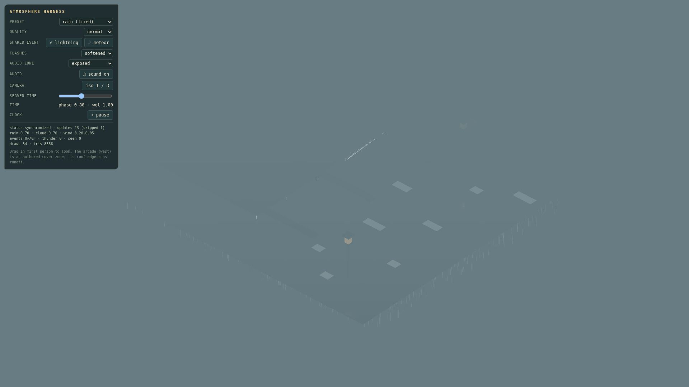
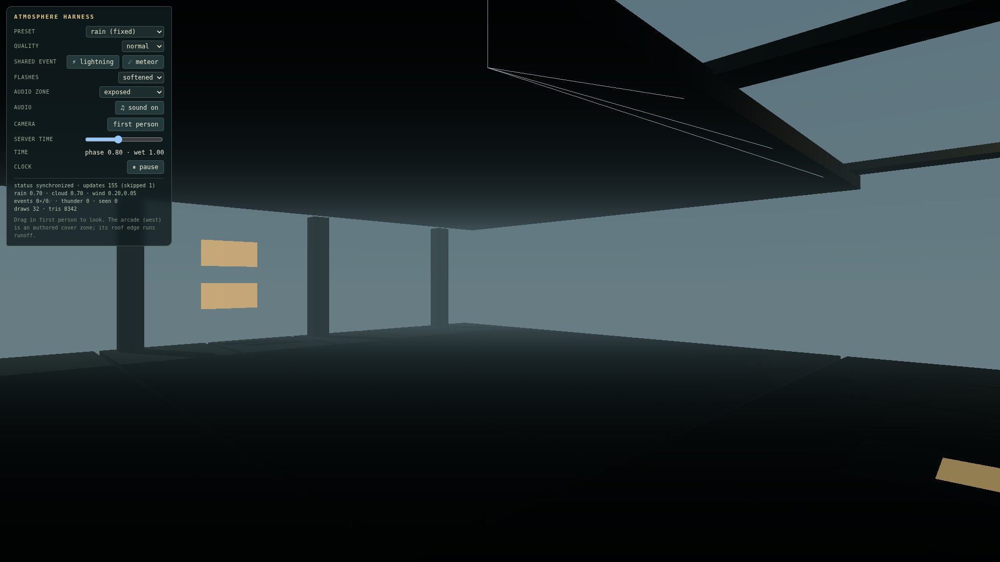
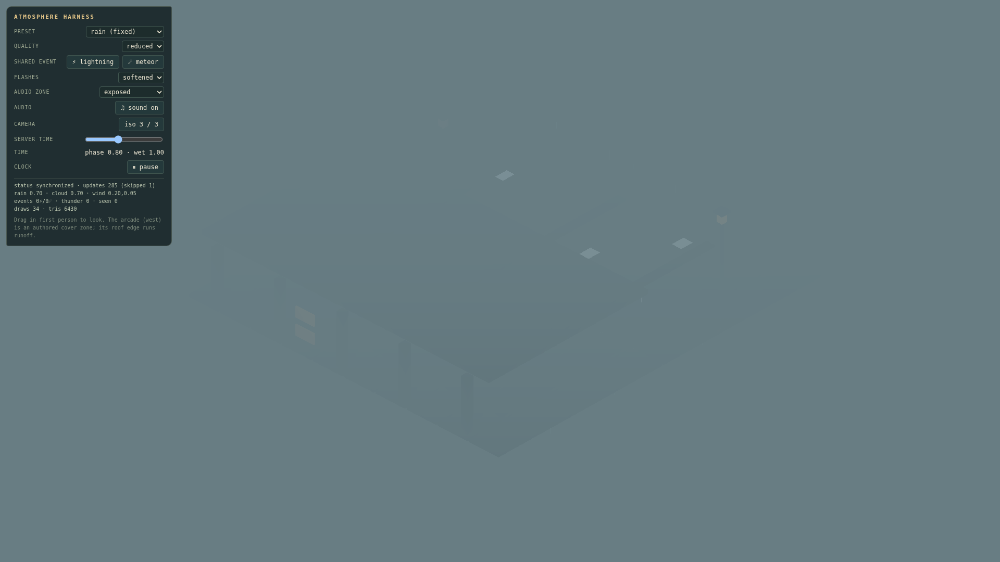
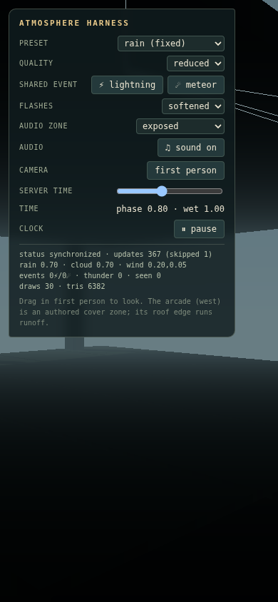

# Atmosphere System Acceptance Report — harness

**Status:** ✓ PASS
**Generated:** 2026-09-08T06:15:19.628Z
**Target Place:** `harness`

## 1. Environment & Hardware

| Property | Value |
|---|---|
| Git Commit | `926a802b0020b43925f80a2040c4001327245e40` (dirty) |
| OS / Platform | linux 7.0.0-30-generic (x64) |
| CPU | AMD Ryzen 9 5900X 12-Core Processor (24 cores) |
| System RAM | 22.9 GB |
| Browser | Chromium headless |
| Viewport & DPR | 1920×1080 @ DPR 1 |
| WebGL Renderer | `ANGLE (Google, Vulkan 1.3.0 (SwiftShader Device (Subzero) (0x0000C0DE)), SwiftShader driver)` |
| WebGL Vendor | `Google Inc. (Google)` |

## 2. D8 Budgets & Ceilings Verification

| Metric | Ceiling | Measured (Normal) | Measured (Reduced) | Status |
|---|---|---|---|---|
| Rain drops | 4096 / 1024 | 4096 | 1024 | ✓ Pass |
| Splash / ripple instances | 128 / 32 | 128 | 32 | ✓ Pass |
| Particle render batches | ≤ 6 / ≤ 3 | 3 | 2 | ✓ Pass |
| Atmosphere draw calls | ≤ 12 / ≤ 6 | 6 | 6 | ✓ Pass |
| Atmosphere CPU p95 | ≤ 2.0ms / ≤ 1.0ms | 0.5ms | 0.2ms | ✓ Pass |
| Additional shadow lights | 0 | 0 | 0 | ✓ Pass |
| 20-cycle resource soak | 0 growth | `clean` | `clean` | ✓ Pass |

## 3. Matrix Performance Measurements

World baseline (atmosphere inactive): **28 draw calls**, **5246 triangles**.

| Quality | Cam | Repeat | Total Draws | Atmo Draws | Triangles | Frame p50 | Frame p95 | CPU p50 | CPU p95 |
|---|---|---|---|---|---|---|---|---|---|
| normal | 0 | 1 | 34 | 6 | 8366 | 216.6ms | 400.1ms | 0.1ms | 0.2ms |
| normal | 0 | 2 | 34 | 6 | 8366 | 216.6ms | 216.7ms | 0.1ms | 0.2ms |
| normal | 0 | 3 | 34 | 6 | 8366 | 200ms | 216.7ms | 0.1ms | 0.2ms |
| normal | 1 | 1 | 34 | 6 | 8366 | 200.1ms | 216.7ms | 0.1ms | 0.2ms |
| normal | 1 | 2 | 34 | 6 | 8366 | 233.2ms | 250.1ms | 0.1ms | 0.2ms |
| normal | 1 | 3 | 34 | 6 | 8366 | 233.4ms | 283.3ms | 0.1ms | 0.2ms |
| normal | 2 | 1 | 34 | 6 | 8366 | 266.6ms | 266.7ms | 0.1ms | 0.2ms |
| normal | 2 | 2 | 34 | 6 | 8366 | 216.7ms | 249.9ms | 0.1ms | 0.2ms |
| normal | 2 | 3 | 34 | 6 | 8366 | 200ms | 216.7ms | 0.1ms | 0.2ms |
| normal | 3 | 1 | 32 | 4 | 8342 | 216.6ms | 233.3ms | 0.1ms | 0.2ms |
| normal | 3 | 2 | 32 | 4 | 8342 | 250ms | 250.1ms | 0.2ms | 0.5ms |
| normal | 3 | 3 | 32 | 4 | 8342 | 233.3ms | 250ms | 0.1ms | 0.1ms |
| reduced | 0 | 1 | 34 | 6 | 6430 | 200ms | 216.6ms | 0.1ms | 0.2ms |
| reduced | 0 | 2 | 34 | 6 | 6430 | 216.7ms | 233.3ms | 0.1ms | 0.2ms |
| reduced | 0 | 3 | 34 | 6 | 6430 | 216.7ms | 249.9ms | 0.1ms | 0.2ms |
| reduced | 1 | 1 | 34 | 6 | 6430 | 216.7ms | 233.3ms | 0.1ms | 0.2ms |
| reduced | 1 | 2 | 34 | 6 | 6430 | 233.4ms | 283.3ms | 0.1ms | 0.2ms |
| reduced | 1 | 3 | 34 | 6 | 6430 | 216.7ms | 233.2ms | 0.1ms | 0.2ms |
| reduced | 2 | 1 | 34 | 6 | 6430 | 200.1ms | 216.7ms | 0.1ms | 0.2ms |
| reduced | 2 | 2 | 34 | 6 | 6430 | 200ms | 200ms | 0.1ms | 0.2ms |
| reduced | 2 | 3 | 34 | 6 | 6430 | 200ms | 200ms | 0ms | 0.2ms |
| reduced | 3 | 1 | 32 | 4 | 6406 | 216.6ms | 233.4ms | 0.1ms | 0.2ms |
| reduced | 3 | 2 | 32 | 4 | 6406 | 216.6ms | 233.3ms | 0.1ms | 0.2ms |
| reduced | 3 | 3 | 32 | 4 | 6406 | 216.6ms | 233.3ms | 0.1ms | 0.2ms |

## 4. 20-Cycle Lifecycle Soak Test

Verified 20 continuous activate/deactivate cycles on the active controller:
- Geometries: before=8, after=3 (growth: -5)
- Textures: before=14, after=13 (growth: -1)
- Audio nodes: before=0, after=0 (growth: 0)
- Result: **CLEAN (Zero resource growth)**

## 5. Visual Captures

### capture-harness-normal-cam0.png (normal, camera 0)

### capture-harness-normal-cam1.png (normal, camera 1)

### capture-harness-normal-cam2.png (normal, camera 2)

### capture-harness-normal-cam3.png (normal, camera 3)

### capture-harness-reduced-cam0.png (reduced, camera 0)

### capture-harness-reduced-cam1.png (reduced, camera 1)

### capture-harness-reduced-cam2.png (reduced, camera 2)

### capture-harness-reduced-cam3.png (reduced, camera 3)

### capture-harness-layout-390x844.png (normal, camera mobile)

