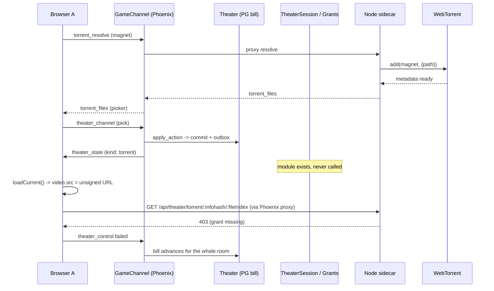
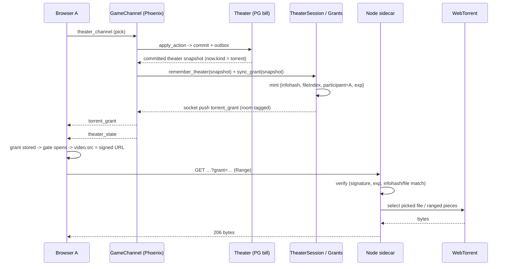
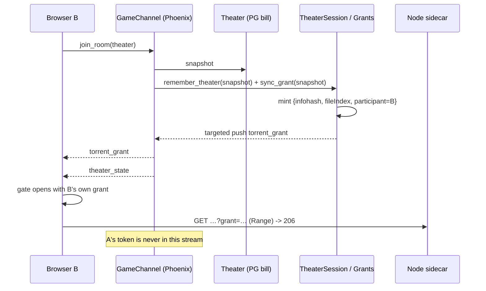

## Context

This design starts from the verified current state (2026-09-10, HEAD `bce0046`), not from the completion checkboxes in `add-node-specialty-adapters` / the archived `fix-theater-streaming-after-elixir-cutover`.

**Broken current sequence (production, `AFTERLIGHT_THEATER_OWNER=phoenix`, Node grants required):**



The same hole exists for a late joiner (join snapshot at `game_channel.ex:743-753`), for other occupants (outbox broadcast at `outbox_relay.ex:72-91` → `RoomServer.broadcast_frame/2` → `GameChannel.handle_info({:world_frame, …})`), and for renewal (`{:torrent_grant_renew, key}` swallowed by the catch-all at `game_channel.ex:353`).

**Desired sequence (acting player):**



**Desired sequence (late-joining Browser B):**



**Constraints that shape the approach**

- Phoenix owns theater authority, participant identity, and grant minting; Node owns the WebTorrent engine, cache, byte serving, and stateless grant verification; the browser consumes Range over HTTP through the Phoenix proxy (`AGENTS.md` §P7 architecture; `docs/architecture/elixir/media.md` §Specialty services).
- One participant token must never be room-broadcast; `theater_state` is public shared state and must stay token-free.
- Grants are short-lived and renewal must be server-driven while the same item/file stays live.
- The existing client (`src/net/client.js`) already stores grants and `TheaterScreenUI.applyTorrentGrant` already refreshes a source; the fix builds on those seams instead of replacing them.
- `TheaterSession` already implements most lifecycle rules; the defect is integration, so the change stays small and explicit.

## Goals / Non-Goals

**Goals**

- Every occupant of The Orpheum is instructed to play the active torrent item only after their own valid, unexpired, participant-scoped grant is stored client-side; the client's first stream request is authenticated and receives `206`.
- Grant issuance is reachable from every production path that delivers `theater_state` (join, acting player, room broadcast), and renewal is reachable from the channel's `handle_info` loop.
- Teardown is explicit: item/file change cancels and re-arms; leaving the theater cancels; stale timer messages cannot mint for a superseded item.
- The behavior is locked by automated tests at the previously missing integration boundary plus one real-browser seeded-torrent acceptance pass.
- Node keeps failing closed; no production fallback, no weaker secret handling, no public room broadcast of tokens.
- WebTorrent adds torrents deselected so only the picked file (and requested ranges) transfers.

**Non-Goals**

- Torrent `.mkv`/`.avi` preparation or transcoding (deferred; see D8).
- Any WebTorrent engine replacement, engine localization, or peer-transport change.
- Moving torrent byte streaming through Phoenix/BEAM.
- Changing the grant token format, HMAC scheme, TTL default (300 s), secret rotation support, or Node verification semantics.
- Changing theater bill ownership, reducer rules, or queue semantics.
- Reviving or hardening the deprecated legacy Node-only transport beyond preserving its relay path (grants are minted from the same code path when the room frame arrives, so the relayed path is covered for free).

## Decisions

### D1 — One chokepoint in `GameChannel` delivers `theater_state`, and it mints first

*Decision:* Add a single private helper, e.g. `push_theater_state/3` (or `deliver_world_frame/3`), used by **every** path that emits a `theater_state` frame to a participant:

1. `maybe_push_theater_join_snapshots/2` (join snapshot, `game_channel.ex:743`)
2. `handle_theater/3` reply reduction (`game_channel.ex:793-812`)
3. `handle_info({:world_frame, room_id, %{"type" => "theater_state"} = frame}, socket)` — the outbox/room broadcast path (and the untagged 2-tuple variant)
4. `handle_info({:relay, "theater_state", fields}, socket)` — legacy relayed path when `Router.theater_phx?()` is false

The helper performs, in order:

```elixir
socket =
  socket
  |> TheaterSession.remember_theater(fields)   # renewal reads the latest snapshot
  |> TheaterSession.sync_grant(fields)          # pushes targeted torrent_grant if now.kind == torrent

payload = fields |> Map.delete("type") |> maybe_tag_room(room_id)
push(socket, "theater_state", payload)
```

`TheaterSession.sync_grant/2` is invoked from the channel process while handling that participant's message/frame, so the targeted push and the state push are serialized on one channel — **grant strictly precedes state** for that participant. The room broadcast path fans out in `RoomServer.broadcast_frame/2` to each member channel; each member's channel executes the helper itself, so each member mints its **own** token and no shared token is ever part of a room frame.

*Why not mint in `OutboxRelay` or `RoomServer`:* those processes do not own participant identity/timers and would need their own per-member fanout with grants attached; doing it at the channel keeps identity, ordering, renewal state, and cleanup in one process. `RoomServer.send_to_member/3` stays available for future addressed frames.

### D2 — Renewal, cancellation, and stale-timer handling live in the channel's `handle_info`

*Decision:* Add a `handle_info({:torrent_grant_renew, key}, socket)` clause **before** the catch-all at `game_channel.ex:353` that calls `TheaterSession.renew_grant(socket, key)` and returns `{:noreply, socket}`. The existing module already:

- re-mints only when the participant is in the theater and the remembered active item still matches `key` (guard, so a stale timer for a replaced item/file pushes nothing and cancels its context),
- cancels the previous timer before scheduling the next (no timer pile-up),
- pushes a fresh grant at ~65% of TTL (before expiry).

Add explicit teardown for travel: `TheaterSession.clear/1` cancels the timer and clears `:torrent_grant_ctx`; `GameChannel.handle_world("join_room", …)` calls it when leaving the theater room (old wire id == `TorrentRules.theater_wire_id()` and new room differs). Disconnect is already safe — timers die with the channel process — and the test suite pins that a terminated channel mints nothing afterwards.

Add room tagging to the grant push (`"roomId" => socket.assigns.world_room.wire_id`) so the client's travel filter can reject a stale grant from a previous room, and add `torrent_grant` to `ROOM_SCOPED_TYPES` in `src/net/roomEpoch.js`.

### D3 — Client gate: no first torrent request without a usable matching grant (defense in depth)

*Decision:* The server ordering (D1) is the primary guarantee; the client enforces it so a lost/reordered frame cannot recreate the bug:

- `NetworkClient` gains `hasUsableTorrentGrant(item, { nowMs, skewMs })` (true only when a stored grant matches `infohash` + `fileIndex`, `expiresAtMs` is present, and `expiresAtMs - skew > now`). `torrentStreamUrl(item)` appends the stored grant; the gate guarantees one exists when it is called for playback.
- `TheaterScreenUI.applyState` handles `now.kind === 'torrent'` before `loadCurrent()`:
  - with a usable grant → existing load path;
  - without → teardown any engine, set the loading overlay, set `awaitingTorrentGrant = { infohash, fileIndex }`, and **do not create the `<video>`** (no request can be issued).
- `applyTorrentGrant` (already registered on `MSG_TYPES.TORRENT_GRANT`): if the grant matches the waiting item, clear `awaitingTorrentGrant` and resume `loadCurrent()`; otherwise refresh an existing `<video>.src` when it differs (today's behavior, now expiry-aware because the URL builder uses the usable grant).
- `setRoomActive(false)` clears the pending-grant state and calls `NetworkClient.clearTorrentGrants()` so grants do not leak across rooms or re-entries.
- Diagnostics events `torrent-grant-wait`, `torrent-grant-received`, `torrent-source-set` are recorded in the existing `?debug=1` ring.

*Why not gate only server-side:* ordering can be broken by any future producer of `theater_state` (or an older server during a deploy rollover). *Why not gate only client-side:* that would rely on a refused request or a retry cycle and could still race the bill advance. Both layers are cheap and composable. *Rejected:* preflighting the stream with `fetch()` before creating `<video>` — doubles request volume (blocking-range video can issue many range requests) for marginal diagnostic value; the server already logs reason categories.

### D4 — Grant lifecycle is keyed by `{infohash, fileIndex}` per participant, and TTL is configurable for tests

*Decision:* Keep `TheaterSession`'s existing `torrent_grant_ctx` keyed by the normalized `{infohash, fileIndex}`. `sync_grant/2` skips re-minting when the same key has a token that does not yet need renewal (`Grants.should_re_mint?/2`), and mints/cancels the old timer when the key changes. `sync_grant/2` with a non-torrent (or absent) live item cancels and clears — so switching to YouTube/HLS/IPTV stops the lifecycle.

Make the TTL configurable through application env (`Application.get_env(:afterlight, :torrent_grant_ttl_secs, 300)`), used by `Grants.grant_ttl_secs/0` and `should_re_mint?/2`. Default behavior is unchanged in production; tests set 1 s to observe a real re-mint before expiry. No token format, claim, or verification change; Node derives expiry from claims only.

### D5 — Security invariants (preserved, explicitly)

*Decision:* The fix mints more often and in more places; every security property stays:

- Minting uses `socket.assigns.guest_id` (set at connect from the signed token), never a client-supplied id; `Grants.mint/3` already requires a non-empty binary participant.
- Tokens are pushed only via `Phoenix.Channel.push/3` to the participant's own socket; `theater_state` never carries a grant field; `RoomServer.broadcast_frame/2` never sees a token.
- Missing/expired/mismatched/malformed grants remain `403` at Node (`server/index.js:362-372`); `TORRENT_GRANTS_REQUIRED=0` remains loopback-dev-only and refused in production.
- Logs: `TheaterSession` emits no token; Node stream logs go through `redactGrantQuery` (already tested); new diagnostics log only infohash prefixes, file indexes, and reason categories.
- Secret rotation (`AFTERLIGHT_TORRENT_GRANT_SECRET_PREVIOUS`, dual-accept verification) is untouched.

### D6 — WebTorrent: `deselect: true` is the correct and sufficient fix

*Decision:* Add `deselect: true` to `client.add(magnetUri, { path: …, deselect: true })` (`server/torrents.js:290`). Verified against installed `webtorrent@3.0.21`:

- `lib/torrent.js:615-626` selects the entire torrent unless `_startAsDeselected` is set; `lib/torrent.js:890` selects each new piece on metadata arrival.
- With `deselect: true`, metadata still arrives (`ready` is metadata, independent of selection).
- `file.select()` (`File.prototype.select`, `lib/file.js:87`) is already called by `streamFile`; and `file.createReadStream` uses `FileIterator`, which `_select`s exactly the needed piece range (`lib/file-iterator.js:32`) and deselects its stream reservation on return (`:107`). Range streaming into unmapped regions therefore still works by design.
- Tests can pin the option by recording `add` arguments in the existing `stubClientFactory` and asserting `deselect === true`; the existing range/selection test (`tests/torrents.test.js:391`) already pins `file.selected === true` after streaming.

*Rejected:* leaving selection alone and documenting it — on multi-file torrents it wastes bandwidth/disk and can visibly slow startup, contradicting the module's own comment. *Rejected:* manually deselecting every file after `add` — races metadata/piece selection and ignores the API that exists.

### D7 — Bounded diagnostics: categories, not secrets

*Decision:*

- Node (`server/index.js`, `server/torrents.js`): log one bounded line per terminal stream outcome with a stable reason: `grant_missing` / `grant_expired` / `grant_invalid` (from `verifyTorrentGrant`), `stream_403` (enforcement), `stream_404` (unknown infohash/index/non-video), `stream_416`, `stream_503` (engine unavailable), `stream_504` (metadata timeout), `stream_stalled` (upstream stream error). The existing `DEBUG_TORRENT_GRANT=1` gate is replaced by always-on warn for refusals (reason + redacted URL + infohash prefix) and debug-level for success/open/first-bytes.
- Phoenix (`TheaterSession`): telemetry `[:afterlight, :torrent, :grant]` with `%{action: :mint | :renew | :clear | :skip, infohash_prefix: first8, file_index: n, participant: hashed?}` — no token, no full magnet. Log nothing at info for tokens; failures at debug with reason.
- Client: existing `?debug=1` playback ring gains `torrent-grant-wait`, `torrent-grant-received`, `torrent-source-set`, and `video-error` with `MediaError.code`/`networkState`/`readyState`. No always-on logging.
- UI copy: while waiting for a grant, the loading caption distinguishes authorization from swarm progress (bounded copy), so a refused/unauthorized stream is not presented as "Reaching the swarm…".

*Rejected:* dumping full magnets or tokens to logs for support — prohibited; *rejected:* a user-visible raw error code — developer diagnostics only, mapped through existing error text.

### D8 — Torrent MKV/AVI preparation is a separate OpenSpec (explicitly deferred)

*Decision:* Do not fold transcoding into this change. The grant fix restores parity for browser-playable torrent files (`.mp4`, `.m4v`, `.webm`, `.mov`, `.ogv`, `.ogg`). A picked `.mkv`/`.avi` torrent will still fail to decode because:

- the torrent picker flags them not browser-playable (`shared/torrentModel.js:47-53`), and
- the ffmpeg/HLS preparation pipeline is `kind: "file"`-only (`shared/mediaModel.js:176-216`); torrent items never receive `prepareStatus`/`playbackUrl`, and their bytes live behind the sidecar's grant-required stream rather than a probeable remote URL.

Solving this properly needs its own proposal (how Phoenix probes/prepares a grant-required sidecar stream without an SSRF/self-call hole, cache/timeline semantics for prepared torrent items, picker UX). Folding it in would balloon this change and delay the live regression. The picker's existing `playable: false` marking plus a readable in-screen decode error remain the honest behavior in the interim.

## Ordering / race analysis

1. **Same-connection ordering.** `TheaterSession.sync_grant/2` pushes inside the channel process before `push(socket, "theater_state", …)`; both are serialized to the same transport, so a client that receives state always received the grant first. The client also stores grants in `handleFrame` before dispatching handlers (`client.js:201-207`), so the grant map is populated by the time the state handler runs.
2. **Join snapshot.** `handle_world("join_room", …)` assigns `world_room` before `maybe_push_theater_join_snapshots/2`, so `in_theater?/1` is true and the grant is targeted at the joiner. Late joiner gets grant → state.
3. **Room broadcast.** `OutboxRelay` sends one `theater_state`; `RoomServer` fans it to members; each member channel mints for itself. No shared token enters the frame. A member who joins between the commit and the fanout is covered by the join snapshot instead.
4. **Acting player.** The reply reduction happens on the acting socket; the grant is minted before the `theater_state` reply. If the actor is not in the theater, `in_theater?/1` is false and no grant is minted (the gateway already rejects the action for `wrong_room`).
5. **Grant freshness vs. stale snapshot.** `renew_grant/2` compares the timer's key against `socket.assigns.theater_snapshot` (updated on every state). A timer for item A firing after item B became live fails the match and cancels; it cannot mint for a superseded item.
6. **Item/file change.** Different key cancels the old timer and mints immediately; the client's gate compares both `infohash` and `fileIndex`, so an old grant cannot authorize the new file.
7. **Travel/reconnect.** Travel out calls `TheaterSession.clear/1` and the client clears its grant map; reconnect/rejoin runs the join snapshot path and mints afresh. `desiredRoom` replay is untouched.
8. **Client first request.** `applyState` refuses to create the media element without a usable grant, so the first HTTP request is authorized by construction; `applyTorrentGrant` only ever resumes a waiting load or refreshes a source, never enables an unsigned first request.
9. **Proxy/Range invariants.** `HTTPProxy` forwards path + query (`target_url/2`) and streams responses without buffering, preserving `206`/`Content-Range`/`Accept-Ranges` (`http_proxy.ex:178-183`, `:194-227`). The grant query parameter already traverses it; no proxy change is needed.

## Alternatives considered / rejected

- **Broadcast a room-wide grant inside `theater_state`** to simplify fanout. Rejected: leaks one participant's token to all occupants and violates the capability model; the spec already forbids it.
- **Mint in `OutboxRelay`/`RoomServer` per member** and attach tokens to addressed frames. Rejected: moves identity and renewal timers out of the channel, duplicates lifecycle state, and couples the room runtime to specialty grants.
- **Mint only for the acting player and let others' clients request grants lazily** (`request_grant` message). Rejected: adds a wire round-trip and a new failure mode; the broadcast path already knows each member and can mint inline.
- **Disable grant enforcement / add an unauth fallback** to unblock playback. Prohibited: it removes the P7 security boundary and re-exposes the stream endpoint.
- **Client-only retry on 403** (wait for grant after a failed first request). Rejected: the first `<video>` failure is classified source-fatal and can advance the shared bill before the grant arrives; relying on failure recovery was the reported bug's shape.
- **Wait for all occupants to acknowledge grants before broadcasting state**. Rejected: unbounded coupling and latency; per-channel mint-before-push is sufficient and deterministic.
- **Fix MKV/AVI torrents inside this change** via the existing media prep. Rejected: the prepare pipeline assumes a remotely fetchable URL, not a grant-gated sidecar stream; it needs its own design (D8).
- **Different transport/peer solution (WebRTC to peers, etc.)** for the perceived swarm symptom. Rejected: the swarm is healthy; the request never reaches it.

## Risks / Trade-offs

- **Mint fanout cost per room broadcast** (one HMAC per occupant per committed change, not per tick). Cheap (a few microseconds each) and only on bill commits; `sync_grant/2` skips minting when the same item is already fresh, so a state re-broadcast does not re-mint.
- **Client gate can strand a player if the grant frame is never delivered** (e.g., server bug). Mitigated by the server ordering + `applyTorrentGrant` resume + reconnect/rejoin path; diagnostics record `torrent-grant-wait`. The gate intentionally fails closed rather than issuing a request that must 403.
- **Configurable TTL could be mis-set in production** (too short → more minting). Default remains 300 s; the env/`Application` value is intended for tests and explicit tuning, with the same re-mint ratio.
- **Always-on refusal logging could be noisy under attack.** Log one bounded line per refused request with a redacted query; no token, no full magnet, no per-range success logging.
- **`deselect: true` changes swarm behavior for seeding-complete torrents** (a fully downloaded file is still served by Range reads via `createReadStream`; WebTorrent reads from the store regardless of selection). Verified against the installed API; tests pin selection and ranged reads.
- **OpenSpec evidence hygiene**: the old checkboxes were wrong. This change records that explicitly and adds the missing integration test instead of re-asserting completion.

## Migration Plan

1. Land the Phoenix wiring + renewal/teardown + room tag (D1/D2/D4) with channel-level tests; run `mix test`.
2. Land the client gate and expiry-aware URL (D3) with JS tests; run `npm test`.
3. Land `deselect: true` (D6) with stub-asserting tests.
4. Land diagnostics (D7) and the log-hygiene assertions.
5. Run the deterministic seeded-torrent browser gate (two browsers; late join; seek/pause; renewal with shortened TTL) and record evidence under this change.
6. Update architecture docs to state the wiring is now code-verified; note the MKV follow-up.

Rollback: revert the commits; no schema, data, or token-format migration is involved. Node's verification logic is unchanged, so an old client on a new server (and vice versa) degrades exactly as before this change.

## Open Questions

- Exact production `AFTERLIGHT_TORRENT_GRANT_SECRET` provisioning is outside this change (both sides currently share the default dev secret when unset). The proposal preserves rotation support; provisioning is an ops item, not a code change here.
- Whether the follow-up MKV torrent preparation should remux from the sidecar cache files directly (shares the `data/torrents` volume) or through the grant-required HTTP stream — decided in that separate OpenSpec.
