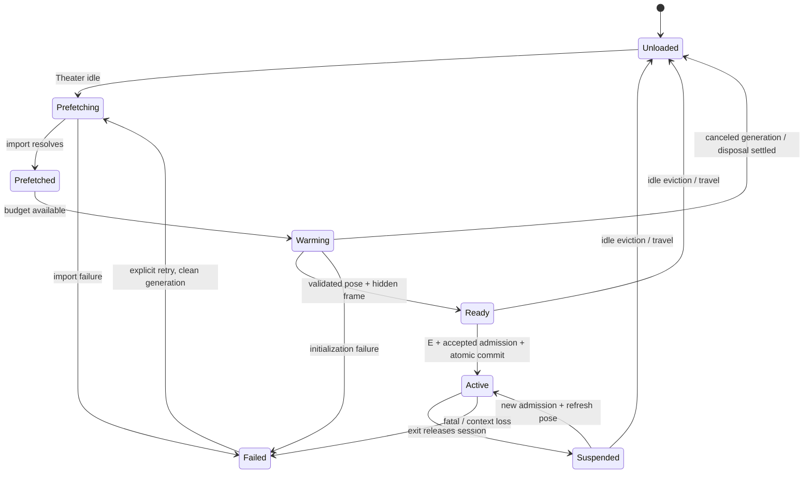

## Context

See proposal.md for motivation. Investigation is against commit `8f9e59d6a`, with a clean implementation worktree at investigation start. Supporting source findings and the footprint inventory are in investigation.md. Historical browser evidence in `../integrate-kart-royale-arcade/evidence.md` is explicitly historical, not a measurement repeated for this proposal. The reported ~30 seconds has not yet been attributed by a fresh browser trace. This proposal changes documentation only.

The integration already uses the host WebGLRenderer, canvas, frame loop, activity view lease, participation manager and optional audio mixer. It does not boot a second application or WebGPU renderer. The expensive work is still done after admission: dynamic import, sequential procedural system initialization, PMREM/material/geometry creation, shader compilation and uploads. Exit destroys the runtime, so a cached module alone does not eliminate repeat construction. The current view lease intentionally wraps boot to protect the Theater from shared-renderer mutations; moving boot earlier without replacing that protection is unsafe.

The hosted destination is character selection, followed by an explicit start and normal countdown. “Interactive” below means the selection UI can accept real input without pending initialization. Time spent choosing a character or in the designed countdown is not loading and must not be silently removed to hit a metric. Report the additional start-confirmation → racing-ready overhead separately.

## Goals / Non-Goals

**Goals:** remove preparation from normal E handling; never present an invalid camera/world; preserve Theater frame-time and renderer state while preparing; make reuse bounded and provably leak-free; preserve the same standalone game implementation and existing social admission.

**Non-Goals:** a new engine, GPU device, universal asset manager, networked racing, custom shader cache, second canvas, arbitrary asset compression, automatic race start, all-minigame startup preloading, or a service worker. This is a lifecycle extension to the existing seams, not a renderer rewrite.

## Decisions

### D1. Measure the critical path before tuning it

Keep lifecycle correctness work mandatory regardless of which stage dominates. First extend the existing browser gate and add optional development instrumentation as described in D10. Attribute CPU generation, GPU submission/compilation, imports and admission separately. Existing prewarm logs are useful but aggregate; they exclude construction and individual system costs. Do not label the entire delay “network” or “shader compilation.”

Current dependency sequence is load-bearing: renderer → sky/environment → materials → track → scenery/race → items/effects/camera/HUD/audio → draw budget → prewarm. Do not replace the systems loop with Promise.all. Module acquisition and seat admission can overlap. Pure independent generation tasks may overlap in a worker only after ownership and data dependencies are demonstrated; yielded main-thread jobs are the initial implementation.

### D2. One prepared runtime, separate preparation and participation

Add a small reusable preparation handle at the activity boundary; implement the Kart-specific build stages inside the existing game host. `src/activities/kart-royale.js` owns preparation while its place generation is active, rather than creating it as a side effect of joining. The heavy controller/host modules may be imported in idle time without requesting a seat. Existing `createResourceCache` stores a synchronous disposable handle whose value owns the in-flight promise; do not cache a bare Promise and assume its eventual value will be disposed.

Conceptual contract (names may follow house patterns): `prefetch()`, `prepare({signal, priority})`, `readiness`, `activate(sessionContext)`, `suspend()`, `dispose()`. Prefetch/prepare calls return the same in-flight promise for their generation. The preparation handle has a resource generation, distinct from the transient admission/view attempt token. Only one constructor/boot may run; eviction must settle or fence pending work before replacement. No new global minigame registry is needed.

Admission has its own idle/joining/queued/participating lifecycle. READY is local rendering readiness, not accepted occupancy. Neither prefetch nor warming claims admission, anchors the player, sends race inputs or starts audio. Authoritative admission must still precede visible activation. Current racing is local player-versus-AI, with Phoenix only admitting/queuing; do not create another socket or room.

Cache identity includes renderer/context generation, quality tier and world configuration. A viewport change invalidates the target/first-frame readiness stamp, not the whole procedural world; resize and validate again. Quality/world changes or context loss invalidate the prepared runtime. No concurrent runtimes: Materials, prewarm and render-surface globals currently preclude that safely.

### D3. Start preparation early; proximity accelerates it

After the Theater's initial loading overlay is removed and its first interactive frame has occurred, schedule one Kart module acquisition using an idle callback with a visibility-aware fallback. Loading-overlay disappearance alone is not the Theater TTI measurement. Honor save-data and slow-connection signals by deferring speculative transfer until proximity/explicit intent. Do not preload other places' activities.

Continue low-priority **incremental preparation**, not just fetch, while Theater remains active and frame-time headroom is available. This is necessary because an 8-unit proximity radius leaves only `(8 - 2.2)/7.5 = 0.77 s` at maximum bhop speed, `1.16 s` running, or `2.07 s` walking. Interaction is 2.2 units; movement is 2.8 walk, 5 run and up to ~7.5 bhop. Proximity-only boot cannot conceal a 30-second workload.

Use 8 units from the cabinet interaction anchor as the initial priority trigger, 10 units to leave high priority (hysteresis), with all calculations in the same x/z frame as interaction detection. These are priority radii, not readiness guarantees. Use the existing place update/throttling/scheduler context, no second RAF. Re-evaluate the actual walkable entrance→cabinet route in the performance gate; include the default cinema-view exit and fast traversal. Never warm during another activity's visible view lease, a hidden document, place travel, or while the Theater is already missing its frame budget.

Initially permit ~2 ms of CPU preparation per host frame at idle and ~4 ms near the cabinet when the rolling frame budget allows; yield when input is pending. These are scheduler targets, not proof that synchronous system init fits. Split measured monolithic hotspots into resumable batches (material families, geometry sectors, scenery groups, kart/livery creation), preserving dependency order and deterministic output. Splitting just the outer 13-system loop is insufficient. A single upload/compile submission is not preemptible; measure it, split material/geometry batches where possible, and pause future work when it causes frame regressions. Use requestIdleCallback only as a trigger, not as a promise that arbitrary work inside it cannot jank.

The desired real-user result is READY before a normal approach. Measure preparation completion versus fastest ordinary walking and running arrival. If procedural work still cannot finish within the available lead time under Theater budgets, reduce attributed generation cost through cached deterministic outputs or targeted generated-asset baking using the same generator source and versioned seed/quality key. This is a measured optimization branch, not permission to call slow cold entry “fixed.” There is no honest hard subsecond guarantee for an immediate cold click with no preparation opportunity.

### D4. Shared-renderer background work is an explicit transaction

Do not invoke today's `host.boot()` concurrently with Theater presentation. `Prewarm.ts` currently binds a render target, changes layers/visibility and awaits compileAsync before restoration. Renderer init, resize, PMREM, composer setup, shadow warm and upload also mutate shared state. The current visible lease protects these mutations; background preparation needs equivalent, shorter protection without taking the visible lease.

Add a frame-owned synchronous GPU work seam next to view-lease renderer snapshot/restore in `main.js`, supplied through activity runtime context. A job runs only between host presentations, never while another activity holds the view. Capture/apply Kart state, submit bounded work, restore host state in `finally` **before returning or awaiting**. Include render target/cube face/mip, viewport/scissor/scissorTest, clear color/alpha, autoClear flags, tone mapping/exposure, output color space, shadow configuration/needsUpdate, pixel ratio/size, XR enablement if touched, and debug callbacks. Keep composer-owned resources separate from global renderer state. Audit actual mutations rather than assuming this list exhaustive. Prefer not changing the canvas drawing-buffer size at all during preparation.

The installed Three r185.1 implementation is verified: WebGLRenderer.js:1487 calls compile synchronously before returning a Promise whose 10 ms poll reads materialProperties.currentProgram readiness. Compilation submission and target-sensitive program selection must occur within the transaction; restore renderer state immediately after obtaining that Promise and await it outside the transaction. Serialize Kart material-variant submissions until their polls settle: recompiling the same material while a prior poll is pending can change the currentProgram that it observes. Maintain hidden Kart-only scene/camera preparation flags as needed until compilation settles, without presenting that scene. If a library phase mutates shared renderer state asynchronously, split or adapt it; never keep an asynchronous lock that freezes Theater rendering for seconds. Validate with alternating Theater renders during a deliberately delayed compile, not only a stub snapshot test.

Retain existing `prewarm` coverage for shadow variants, dormant item/effect materials, and geometry uploads. Current prewarm catches errors and continues, and runtime presentation can swallow failures into its degradation ladder; introduce an explicit preparation/presentation result for the readiness barrier. A deliberate supported fallback must itself pass hidden-frame validation; swallowed errors cannot publish READY. Compilation alone is not READY: exercise the actual Kart post-processing chain in an offscreen full-aspect target after pose initialization. Adapt `RenderPipeline.render` output routing if it currently forces the default framebuffer; no hidden-frame job may write to the visible canvas. A tiny compile scratch target is not evidence the final-resolution composer is ready. Finish with a successful full-chain render, then restore the Theater renderer. Avoid blocking GPU readback in production; use output validity assertions and test-only readback/filmstrips. GPU completion/wall time must be labeled accurately (D10).

Reject a second hidden WebGL/WebGPU renderer: resources/programs cannot simply be transferred to the host context, and it doubles memory. Reject calling compileAsync again at E: it already exists and belongs in preparation. GPU preparation does not involve WebGPU adapter/device/compute pipelines here.

### D5. Destination readiness fixes the under-map exposure

The source chain is concrete: controller acquires a lease before `await host.boot`; the lease immediately exposes `host.ctx.scene/camera` and an unguarded `present`; update is guarded by `booted`, but present is not. The camera is created at origin. `ChaseCamera.init` does not place it; `lateUpdate` first positions it. As the track/scenery are initialized, the origin view becomes a real partial-world frame. Track-sampled grid placement already exists; this is not evidence of a falling physics body. Capture the actual intermediate camera/scene frame in the baseline to confirm the user's exact visual symptom.

Add a runtime readiness barrier, enforced at both host adapter and controller:

1. All required system initialization and deterministic collision/track data are complete. Track initialized/failing systems and ownership for cleanup.
2. Every grid kart has finite position/orientation and a valid sampled road support; reset velocity/jump/respawn state using existing placement logic. Prepare lazy first-step tables such as the corner lookup outside activation.
3. Initialize the Menu/selection camera pose and matrices explicitly, including terrain/tunnel constraints, without stepping physics, AI, effects clocks or countdown. Do not fix this by guessing a Y offset, rendering a default camera, or running arbitrary nonzero simulation frames.
4. Required shaders, uploads, shadow variants and final-size composer preparation have succeeded; temporary visibility/layer mutations are restored.
5. Render one hidden selection frame successfully with valid camera and transforms; publish the readiness stamp only while its generation is current.

Until then visible `present()` is a no-op, game input/session HUD/audio are absent, and source Theater remains presentable. READY does not imply every future optional effect is instantiated anew at activation; existing prewarm registrations cover eventual material variants.

### D6. E commits a prepared view; cold fallback stays safe

At E capture the gesture timestamp and audio-unlock capability synchronously (do not emit game audio), begin/reuse one participation attempt, and promote/reuse preparation concurrently. Do not reserve a seat speculatively. Accepted admission may anchor the host avatar; if preparation is still pending, preserve the visible Theater and a compact cancellable cabinet status. Suppress conflicting host movement while anchored according to existing participation policy. Escape/cancel leaves admission immediately and invalidates only the activation waiter; walking away before admission cancels that waiter. A preparation job may continue at idle priority only while its place generation remains valid.

Once local READY **and** current accepted participation hold, recheck generation, seat ownership, viewport/context and lease availability. Refresh selection/grid pose as required, acquire the canonical view with host-state capture before any Kart renderer mutation, apply Kart renderer settings inside that ownership boundary, attach/mount session HUD and input, unlock/route audio, then present the complete destination. Use an optional 100–150 ms fade within the latency budget; the curtain can protect the commit but must not become the main loading experience. Keep it until one successful visible frame, then remove it. A render failure rolls back source ownership before the curtain clears.

The destination is selection on every new admission; preserve rematch while active. Suspended resources are reused, but leaving is not a promise to resume an old race or hold its seat. Reset mutable race/UI/timing state through an allocation-free `prepareSession` operation that explicitly returns to RaceState.Menu, selects the selection screen, and clears results/items/input/UI edge state. Existing Race.reset/start enters Countdown (Race.ts:239/276) and must not be mistaken for reset-to-selection. Perform that preparation and pose validation while suspended when feasible. Reentry must not regenerate immutable world/texture data. Start selection controls only after valid view commit; consume entry keyup so E cannot also fire an item. Exit, blur and travel neutralize both input systems.

Cold preparation remains in the Theater with honest status and a cancel action. Do not show an endless fade or invalid Kart world. Distinguish queue wait from preparation. Bound stalled import/admission/preparation waits with a configurable initial 60-second total attempt deadline, visible retry/cancel, and stage diagnostics; elapsed time does not fabricate readiness. An occupied cabinet can stay queued under existing semantics, with a queue-specific cancel rather than treating it as a graphics failure. On cancel, return to a validated cabinet dismount without losing Theater state.

### D7. Suspension and resource budget

Use one cached preparation handle and existing cache scheduling, default 60-second idle eviction. READY with no interested nearby user also starts an idle eviction window; repeated proximity events do not repeatedly construct/evict or keep renewing a deadline without actual interest. Release active session refs on exit; retain a zero-ref warm entry so eviction works. Audit resourceCache owner/ref accounting and timer cancellation with fake-clock tests before relying on it. Ensure the scheduler is running with a real clock.

Retain parsed/generated geometry, textures/materials, track/collision/AI tables, karts, PMREM, compiled programs via their live materials, composer/render targets and immutable synth data only within the budget. Suspend all update/present/simulation, stop and disconnect active audio voices, remove input/touch/window/context subscriptions owned by the session, unmount HUD/root and session CSS state, release participation and the view. Do not close an injected host AudioContext; defer private context and voice construction to the entry gesture. Detached reusable HUD data/root is fine; no live global listeners or duplicate IDs in cache. Split HUD/Menu and Audio init into resource preparation and session mount/listen/voice phases; current init installs controls/listeners. Do not dispose these whole systems on suspend and then assume they can resume without rebuilding.

Keep a conservative allocation ledger for owned CPU buffers/canvas images and GPU geometry/texture/mipmap/render-target bytes, with shared resources counted once. WebGL does not expose reliable free VRAM; renderer.info counts are counts, not byte measurements. Initial admission caps for retaining a prepared runtime are 256 MiB estimated GPU and 256 MiB estimated owned CPU allocations; at reported deviceMemory <=4 GiB use 128 MiB each. Unknown devices use default caps plus frame-pressure checks. These are protective policy ceilings, not claims that the current game fits. Record actual current totals in baseline. If over budget, do not keep it suspended or speculatively warm repeatedly; allow explicit active play then dispose on exit, with performance results reported as uncached. Reduce retained optional allocations only with visual/runtime equivalence evidence. Do not create an LRU for a single slot.

Evict on idle timeout, leaving Theater, context loss, incompatible quality/config, explicit memory-pressure/debug request, or fatal initialization. No portable browser memory-pressure event is assumed. Stop speculative warming if Theater is persistently slow. Disposal is single-flight, reverses initialized ownership, waits for noncancelable GPU work to settle and then frees all owned resources. Exception: compileAsync has no cancellation/rejection deadline. A 60-second attempt deadline can fail the user operation but cannot cancel its internal poll. Quarantine at most one outstanding compilation and its materials, block replacement/warm retries until it settles, and clean it on settlement. Do not dispose polled program properties prematurely. On context loss or a poll that never settles, invalidate the cache and require reload for graphics recovery; release session ownership immediately and keep Theater usable if its shared context is still valid. Never report quarantine as completed memory reclamation. A permanently lost context is outside ordinary eviction-soak acceptance and must have a separate recovery test; no retry-created timer/resource accumulation is allowed. Audit Race.dispose (currently merely removes karts), Materials/prewarm/render-surface registries, procedural texture caches, composers, sky environment targets, effects pools, audio voices and event-bus subscriptions. Never dispose shared renderer/canvas, host audio, Phoenix socket or cabinet model/materials.

### D8. Cancellation, authority and races

Use distinct resource-generation and activation-attempt tokens. Every await and scheduled continuation checks the appropriate token before publication, HUD mutation, renderer work, admission action or lease acquisition. Capture the local host instance in continuations; do not dereference mutable `host` after it may have been cleared. Abort signals stop scheduled CPU jobs/fetches where supported; dynamic import and compile completion may be noncancelable, so quarantine late results and dispose exactly once. Host boot returns its real in-flight promise rather than setting a boolean and resolving subsequent calls early.

| Event | Required resolution |
| --- | --- |
| Approach → leave → approach | One preparation handle; priority changes with hysteresis; no seat until E. |
| Repeated E while pending | Reuse the pending activation; do not create another join/runtime. Use Escape/explicit cancel for reliable cancellation; update any old E-to-cancel prompt/tests. |
| E while warming | Subscribe to same readiness promise and parallel admission; preserve Theater until both ready. |
| Travel/dispose mid-import or init | Invalidate place/resource and activation tokens; no late join or view takeover; clean partial ownership. |
| Cancel activation while warming | Release pending/accepted admission; detach waiter; prepared work remains background-only if still valid. |
| Re-enter while suspended/evicting | Reuse settled prepared state or wait for eviction before a single new instance; never overlap runtimes. |
| Seat ejection/disconnect during commit | Validate occupancy even when participation clears currentActivity; release/rollback view immediately, no race can continue unadmitted. |
| Init throws/asset missing | Mark FAILED, settle cleanup, preserve Theater and expose explicit retry; no retry storm. |
| Fatal frame/context loss | Stop Kart, release session/view; invalidate cache. A lost shared GL context may require page reload; never claim Theater pixels recovered without proof. |

Attach context-loss handling to renderer.domElement (native canvas events do not bubble), and feed the existing transport-disconnect callback into pending/active admission cancellation. Capture renderer policy before leased resize; restore dimensions for the current viewport after exit. Fix the existing outer controller import's missing stale-generation check and the seat-loss predicate that expects currentActivity to remain set after participation reset. Tests must exercise actual participation clearing semantics. Preserve onRelease idempotence and avoid exit→dispose→release recursion.

### D9. Asset and dependency decisions

Use the inventory in investigation.md. Kart's first-playable content is procedural JS, not fetched GLBs/audio/WASM. No Draco/Meshopt/KTX2 addition is justified for a missing asset waterfall. Cache-Control for hashed build chunks is useful for downloads but cannot cache generated scenes or GPU programs as a ready game.

The inspected build duplicates substantial Three source because the nested Kart dependency can resolve separately. Before adding Vite dedupe, remove/scope Kart's global `Texture.prototype.needsUpdate` budget patch to Kart-owned textures: deduping without this would expose Theater textures to Kart's budget policy. Then verify one Three module graph and compare production raw/gzip/module-evaluation times, plus Theater texture quality. Pin no chunk filenames in prefetch logic; use the existing dynamic import boundary and Vite dependency graph. Recheck scoped CSS/module side effects before idle import. Browser module cache may retain evaluated code until refresh even after runtime eviction; document that distinction.

Only optimize attributed generation hotspots. Candidate branches: deterministic generated texture/geometry memoization by seed/tier, deferring noncritical UI/HUD embellishments and audio voices, or build-time baking with generated outputs under versioned keys. A worker is justified only for measured pure CPU work with transferable typed arrays; canvas/DOM/WebGL classes cannot simply move there. Preserve required road collision, all visible selection assets, selected kart and full AI field. Optional item variants may be prepared later only if first-use hitch tests remain within budget; current broad prewarm likely exists for a reason. Quantify savings before adding dependencies or changing visual quality.

### D10. Instrumentation and performance gates

Development-only opt-in mark prefix `afterlight:kart:<resource-generation>:<attempt>:<phase>`. Store bounded records (last 20 attempts); clear marks/measures on eviction or rollover. Preserve existing aggregate logs but export structured JSON from the browser gate. Log errors/cancel reasons and tier/viewport/device/browser/build/GPU backend (software rendering identified) without chat/player identifiers.

| Span / event | Exact seam and meaning |
| --- | --- |
| interaction / transition-begin | main E dispatch → pending activation/commit curtain; distinguish pending wait from visible transition. |
| controller-import / host-import | each existing dynamic import start/end; module fetch+parse+evaluation aggregate. ResourceTiming for transfer; do not pretend import duration is parse alone. |
| construct | createKartRoyaleHost/runtime constructor separately from boot. |
| system-wait / system-init:name | each scheduler wait and each of the 13 init phases separately, including partial batch timings. |
| asset-fetch/decode | ResourceTiming for actual required files and explicit decoder boundaries only when present; current external Kart asset/WASM decode spans are N/A, not zero-cost measurements. |
| generated-textures / world / physics | Materials/Textures families; Track/Scenery; Race.formGrid and collision/corner-table preparation, no WASM label. |
| GPU-prepare | pipeline/composer init, sky PMREM, compile submission and awaited completion, shadow variants, geometry/texture upload submission, first offscreen full-chain render separately. |
| admission | participation join request → accepted seat/queue/error; overlap with preparation, never double count in total. |
| spawn-valid / pose-valid / ready | validated grid/support; camera matrices; generation readiness barrier. |
| first-visible-frame | first successful real destination presentation followed by browser frame observation; not lease acquisition/HUD insertion/boot-resolved. |
| input-ready | actual selection input handler active and safe, after commit; scripted test input must change selection. |
| race-start-ready | confirmation → initialization overhead before the designed countdown; countdown duration reported separately. |
| TOTAL | E timestamp → first visible/input-ready, with cold/prefetched/ready/suspended route and cancel/failure status. |

CPU `performance.now` around render measures submission cost, not GPU execution. compileAsync time is wall time including driver completion polling. Where available use nonblocking disjoint timer queries for GPU work and discard disjoint samples. Do not add gl.finish or synchronous readPixels to production timing. For decode/upload without reliable isolation report aggregate and limitations. Capture long tasks, host frame intervals, resource requests, renderer.info programs/geometries/textures and owned allocation ledger. Per-frame debug capture should include readiness state, presented owner, camera position/matrices, grid validity and generation; filmstrip/readback is test-only.

Acceptance cohort: record exact browser/GPU, resolution/DPR, tier, transport RTT and build; use production build plus dev-only diagnostic switch. Collect at least 20 warm/repeat transitions after initial priming and at least five cold loads per reference device. Include one hardware desktop GPU and one constrained/integrated/mobile-class GPU. SwiftShader is useful for correctness stress but cannot establish hardware performance. Standard entry timing assumes unoccupied seat, no reconnect, visible foreground page, <=100 ms admission RTT and prepared resources within cache budget. Queue/network waits are reported separately; never omitted from raw E-total.

| Metric | Preferred | Release gate under cohort conditions |
| --- | --- | --- |
| READY E → first complete visible selection frame | <=250 ms | p95 <=500 ms |
| READY E → selection accepts input | <=500 ms | p95 <=1,000 ms |
| Suspended reentry E → first frame | <=200 ms | p95 <=200 ms, with admission RTT recorded |
| Suspended reentry E → input-ready | <=200 ms | p95 <=500 ms |
| Confirmation → race initialization overhead | no new heavy work | <=100 ms excluding intentional countdown |
| Cold fallback | no fixed subsecond claim | 0 invalid frames; cancel handled <=100 ms when main thread is available; bounded attempt/error state |
| Theater TTI vs no speculative preparation | no regression | median/p95 increase <=5% and <=100 ms (both bounds) |
| Theater walking during preparation | no perceptible jank | p95 frame interval increase <=2 ms; no added preparation CPU task >50 ms; record p99 and max |
| 20 retained cycles | flat after prime | 1 canvas/renderer/RAF; 0 extra session listeners/subscriptions/physics instances; post-suspend owned counts stable |
| Post-eviction memory | reclaim owned data | owned GPU ledger/resources return to baseline; forced-GC JS heap within max(10%,20 MiB) of module-prefetched baseline, no sustained rise across 20 cycles |

These are targets, not current measurements or promises on arbitrary networks/hardware. Also record READY hit rate for walk/run/capped-bhop arrival after Theater TTI and preparation lead time (0, 2, 5, 10, 30 seconds). Demonstrate normal walking entry reaches READY in at least 19/20 reference desktop runs after completing baseline-driven cost reductions; fastest fresh-load arrival may safely use cold fallback. A report of “warm entry fast” alone cannot pass if normal users still routinely wait 30 seconds.

### D11. Test plan and reconciliation

Extend `tests/kart-royale-controller.test.js`, cabinet tests, activity cache/participation/view tests and `scripts/kart-royale-gate-browser.mjs`. Add pure state-machine/fake-scheduler tests with deferred import/boot/compile promises. Cover every D8 row, repeated promise identity, disposed boot resumption, target restoration under failed/pending compile, and lease release when currentActivity becomes null. Assert no visible present before readiness at both adapter and consumer boundaries.

Browser gate must observe frames from E through readiness, not only wait for HUD text with the existing 120-second timeout. Record camera/road validation and a filmstrip; test deliberate delay at every init phase, first entry, early E, warm entry, 20 exits/reentries, queued second user, real input switching/E-as-item/blur, each exit menu, travel, refresh, slow/offline network, failed import, injected system/compile/present exceptions, resize/quality change, context loss and low-tier GPU. Exercise full race/rematch so deferred work does not shift hitches into the first item/drift/lap. Validate renderer state and visual Theater capture after every GPU warm batch and exit.

Regression: root Node suite and production build; Kart TypeScript/build, standalone autoplay/drift/screenshots/context-loss gates; existing snowboard entry/exit. The predecessor records a known standalone context-restoration composer issue and incomplete memory soak; track these explicitly, do not count historical passes as new evidence. No unrelated rendering tests are required to validate this documentation-only proposal.

This capability supersedes the predecessor's statements that bystanders never fetch the game until E, that construction must be leased before boot, and that every exit fully destroys resources. Archive reconciliation must update the unarchived Kart arcade/runtime/verification specs together when both changes land; if the predecessor has been archived by implementation time, author corresponding MODIFIED deltas then. Preserve single-renderer/input/HUD/audio/disconnect requirements; cached resources do not permit live session listeners after exit. Leave unrelated incomplete predecessor tasks and P6 migration claims untouched.

## Risks / Trade-offs

- [A procedural build truly takes longer than the approach window] → start idle preparation, measure and reduce generation cost; expose honest cold fallback and gate actual READY hit rate.
- [Shared renderer mutated between host frames] → synchronous state transactions, no await while globally mutated, offscreen full-chain target, delayed-compile visual regression.
- [Global texture/material/prewarm state contaminates Theater or next instance] → single prepared runtime; scope texture budget patch before dedupe; explicit registry ownership/reset on eviction.
- [Retention hides leaks rather than fixes them] → eviction/rebuild soak in addition to retained reuse; allocation ledger and forced-GC evidence; no caching rollout before teardown gates.
- [Memory ceilings exclude weak devices] → measured per-tier retention decisions and safe uncached path; no arbitrary visual downgrade.
- [Admission RTT dominates otherwise instant reentry] → parallel work, retain existing socket, report RTT; no speculative seating or invented local authority.
- [Audio/DOM init runs during warm] → separate session activation effects from resource generation and verify listener/audio counts while never entering.

## Migration Plan

1. Land diagnostic hooks and baseline evidence first; then readiness/under-map correctness with background preparation disabled.
2. Land cancellation/teardown and safe renderer transaction seam, verified independently with delayed phases.
3. Add single-runtime preparation and idle/proximity scheduling behind a development rollout toggle; enable only after Theater and ownership gates pass.
4. Add suspension with budget/eviction evidence, then measured dependency/generation optimizations and full performance validation.
5. Enable default staged preparation, document cold/queue behavior, reconcile predecessor specs and record environment-qualified results. No server protocol/data migration is expected.
6. Rollback speculative preparation/retention via the toggle, retaining safe readiness-gated cold entry and cleanup fixes. Do not revert to visible boot-under-lease. No deploy is authorized by this proposal task.

## Open Questions

Deferrable measurements: phase distribution of the user's 30 seconds; exact generated allocation totals at each tier; READY lead time on reference devices; fraction attributable to duplicated dependency evaluation; whether postprocessing warm coverage still compiles on first active frame. Baseline tasks answer these without changing the selected lifecycle or safety contract. Live CDN headers and real network RTT require deployment-specific evidence; local build filenames alone do not establish them.
