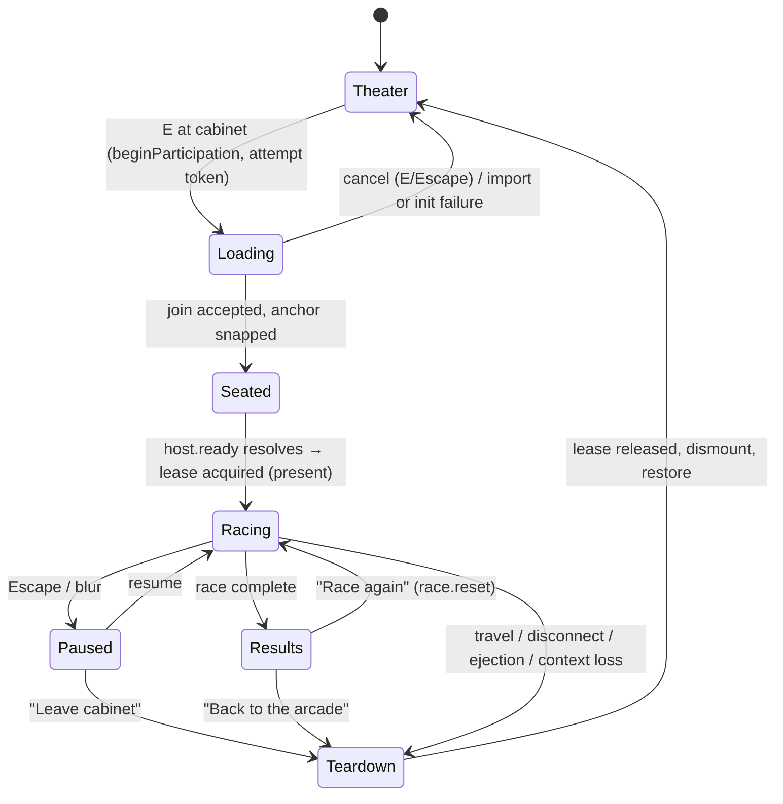

## Context

Afterlight's Orpheum has five upright arcade cabinets driven by a canonical
system (`src/arcade/{cabinet,skins,artwork}.js`, manifest blocks in
`shared/placeDefinitions.js`) and a canonical activity stack (registry →
runtime → participation → view lease) proven by Summit Run
(`src/activities/snowboard.js` + `snowboard/controller.js`), which lazily loads
a large 3D race scene that borrows the host renderer through
`src/activities/viewLease.js`. The repository now also contains Kart Royale
(`games/kart-royale`) — a ~65k-line TypeScript Three.js racer with its own
renderer, RAF loop, input manager, procedural world, 8-kart AI field, items,
`postprocessing`-package composer (N8AO/DoF/bloom/motion-blur/grade/SMAA),
quality tiers, Web Audio synth stack and 20+ tool harnesses — currently a
standalone Vite app with **no teardown path** (its `dispose()` methods are
orphaned; `main.ts` owns an unstoppable RAF).

This change makes that exact game playable from a repurposed Theater cabinet
without duplicating it. The full repository archaeology backing every decision
below is in `investigation.md`.

## Goals / Non-Goals

**Goals:**

- Repurpose one existing cabinet (D1) into a fully themed Kart Royale machine
  using the existing cabinet/skin/attract systems.
- Host the real game through the canonical activity stack — one renderer, one
  RAF, view lease presentation — preserving racing quality identically.
- Single source of truth for game code in `games/kart-royale`; standalone
  development keeps working; no divergent copy.
- Deterministic, leak-free lifecycle: load → seat → race → pause/results →
  exit → restore, repeatedly.

**Non-goals:** networked Kart Royale multiplayer; spectating live race
telemetry; a second cabinet model (racing cockpit GLB) — v1 uses `upright`;
durable rankings; host-world WebGL context-loss recovery (pre-existing gap);
iframe/second-app hosting (rejected outright, per the Summit Run precedent).

## Reconciliation with unarchived changes

- `add-place-activities-program` (capability `orpheum-arcade`): its "three
  original games" presentation requirement becomes two (Rain Runner, Signal
  Lost) plus Pong, Kart Royale and Summit Run. The requirement text lives only
  in an unarchived delta, so this change records the supersession in its
  proposal banner rather than a `MODIFIED` spec; at archive time the
  `orpheum-arcade` requirement must be rewritten then (same procedure
  `integrate-ssxtricky-snowboard` documented for its parent).
- `add-multiplayer-snowboard-arcade` / `integrate-ssxtricky-snowboard`: this
  change **extends** their canonical infrastructure (view lease gains an
  optional `present` hook; runtime may pass `audioMixer`) and does not
  supersede any of their requirements. Summit Run behavior is unchanged.
- Working-tree note: uncommitted deletions at repo root (downhill-mayhem,
  operation-ironhold, turbo-kart-rush moved into `games/`) are an unrelated
  in-progress move; this change must not touch or revert them.

## Decisions

### D1 — Cabinet identity and repurposing

**Repurpose `orpheum-sporefall`** — the fourth upright at
`transform.position [10.42, 0, -1.8]`, `rotationY -π/2` — into
`KART_ROYALE_ACTIVITY_DEFINITION`:

```js
{
  id: 'orpheum-kart-royale',
  type: 'kart-royale',            // added to ACTIVITY_TYPES
  title: 'Kart Royale',
  sub: 'Press E to race · Drift · Boost · Win',
  rulesVersion: 1,
  cabinet: { model: 'upright',
    skin: { title: 'KART ROYALE', tagline: 'DRIFT • BOOST • WIN', motif: 'kart',
            palette: { base: '#241408', ink: '#f6ead2', accent: '#ffb347', glow: '#ff7a3c' } },
    led: { color: '#ffb347', intensity: 1.4 },
    controls: { player1: '#ffd166' },
    screen: { type: 'canvas' } },
  transform: { position: [10.42, 0, -1.8], rotationY: -Math.PI / 2 },
  footprint: { width: 0.85, depth: 0.9 },
  interactionRadius: 2.2,
  participantAnchors: [{ slot: 0, position: [9.3, 0, -1.8], facing: Math.PI / 2,
                         dismount: [{ x: 8.55, z: -1.8 }] }],
  capacities: { players: 1, spectators: 16, queue: 8 },
  environmentPolicy: 'none', spectatorPolicy: 'world',
  rendererKey: 'kartRoyaleCabinet', controllerKey: 'kart-royale',
}
```

Geometry is deliberately identical to Sporefall's, so `theaterWorld.js` needs
**no change** (the bay stud at z −1.8 already exists). Why Sporefall and not
another machine: it is the southernmost row cabinet, adjacent to the Summit Run
bay (z 2.6) — grouping the two large racing machines at the south end while the
north end keeps the quick-play cluster; it is single-player like the game; and
Summit Run stays untouched (the multiplayer flagship and its 8-anchor bay).
`SPOREFALL_ACTIVITY_DEFINITION` and `src/activities/sporefall.js` stay in the
repository; Sporefall simply leaves `ORPHEUM_ACTIVITIES` (dormant, re-placeable
by a future manifest edit). Regenerate the projection with
`node scripts/export-place-definitions.mjs`; `--check` must stay clean.
Artwork: new `'kart'` painter in `src/arcade/artwork.js` `MOTIFS` (checkered
strip, procedural kart silhouette, drift sparks, speed lines, golden-hour
palette); no per-game public files needed. `tests/arcade-cabinet.test.js`
updates: five machines with the new skin/LED distinctness, anchor/dismount
clearance at the reused coordinates, motif uniqueness on shared geometry.

### D2 — Kart Royale host boundary (module layout and API)

**Single source stays in `games/kart-royale`; Afterlight glue lives in
`src/activities/kart-royale*`; the host adapter lives with the game.**

```
games/kart-royale/src/
  main.ts                  → thin standalone shell (renderer, RAF, #app/#ui/#boot, globals)
  host/runtime.ts          → NEW: createKartRoyaleRuntime(options) — systems array, boot
                             sequence, update/present/resize, adaptive ladder, pause/reset
  host/index.ts            → NEW: createKartRoyaleHost(options) — runtime + input routing +
                             audio + HUD hosting + race pass-throughs + dispose
  render/Renderer.ts       → RenderPipeline accepts externalRenderer (skip createRenderer,
                             canvas append, context-loss ownership)
  core/Input.ts            → Input exposes handleKeyDown/handleKeyUp/neutralize; window
                             listener installation becomes attach/detach
  core/Settings.ts         → accepts injected params; hosted mode never reads location.search
  audio/Audio.ts, Synth.ts → external context + ownsContext flag
  ui/HUD.ts                → honors an explicit host element before falling back to #ui
src/activities/
  kart-royale.js           → NEW bystander module: registerActivityModule('kart-royale'),
                             createArcadeCabinet + attract/occupied painter (canvas)
  kart-royale/controller.js→ NEW lazy controller: attempt token, participation, view lease,
                             input capture, HUD body class, audio mixer injection, exit paths
```

`createKartRoyaleHost(options)` (derived from the real system shapes — `Ctx`,
`System[]`, `RenderPipeline`, `Input`, `Audio`, `HUD`, `Race`):

```ts
options: {
  renderer: THREE.WebGLRenderer;            // external, required when hosted
  viewport: () => { width: number; height: number } | null;
  hudHost: HTMLElement;                      // explicit HUD root
  audio?: { context?: BaseAudioContext; destination?: AudioNode };
  params?: Partial<QualitySettings>;         // injected quality/feature overrides
  startScreen: 'select' | 'race';            // hosted lands on roster select
  onBootProgress?(frac: number, label: string): void;
  onFatal?(error: unknown): void;
}
returns: {
  ready: Promise<void>;                      // systems initialized + prewarmed
  update(dt: number): void;                  // systems update + lateUpdate + ladder accounting
  present(): void;                           // PostFX.sync + composer.render via RenderPipeline
  resize(w: number, h: number): void;        // aspect + systems + pixel-ratio policy
  input: { handleKeyDown(e): void; handleKeyUp(e): void; neutralize(): void };
  race: { selectKart(i): void; reset(): void; setPaused(b): void; state(): RaceState };
  setMuted(b: boolean): void;
  dispose(): void;                           // walks every system's dispose
}
```

Ownership table:

| Resource | Owner when hosted |
| --- | --- |
| WebGLRenderer, canvas, RAF, resize events, composer (host) | Afterlight `main.js` |
| Scene, PerspectiveCamera, `postprocessing` composer, quality/DPR policy, game DOM (HUD/menus/touch), game audio voices, gamepad polling | Kart Royale host runtime |
| Participation, anchors, dismounts, snapshots, queue | `src/activities/participation.js` + Phoenix SessionServer |
| View lease, renderer-state snapshot/restore, input suspension, HUD body class | Afterlight (extended narrowly, D3/D5/D6) |

Rejected alternatives: **workspace package** (no precedent; doesn't fix the
three-version conflict), **copying the tree into `src/activities/`** (divergent
copies of 65k lines — explicitly forbidden), **importing from an iframe/static
build** (rejected by the SSXTricky design precedent: "no iframe or second
runtime"), **keeping the game's own renderer** (second WebGL context on the
page, two RAF loops — the exact failure mode the view lease exists to prevent).

### D3 — View/render ownership: the `present` lease hook

The Summit Run lease swaps `renderPass.scene`/`renderPass.camera` inside the
host's three-addons composer (`src/main.js` `apply`, lines 128–161) —
insufficient for Kart Royale, whose chain (N8AO → DoF+bloom → grade/motion
blur → SMAA) is built on the **`postprocessing` package's** `EffectComposer`
(`games/kart-royale/src/render/PostFX.ts`), which is API-incompatible with
three-addons passes. Two composers **can** share one renderer; only one may
present per frame.

**Decision:** `acquireView({ owner, generation, scene, camera, resize,
onRelease, present? })` — `src/activities/viewLease.js` gains an optional
`present: () => void` payload field (pure data; no behavior change for existing
lessees). `main.js`'s held branch (`frame()`, lines 2023–2033) becomes:

```js
activityRuntime.update(now / 1000, dt);
if (typeof lease.present === 'function') lease.present(); else composer.render();
```

Kart Royale passes `present: () => host.present()`. The host composer renders
to the shared renderer's drawing buffer; the host's bloom stays disabled while
held (existing `apply` behavior). Renderer-state safety: the `postprocessing`
package manages tone mapping/output color space inside its own passes and
restores renderer state after rendering, but the lease generalizes the existing
exposure save/restore into a **snapshot/restore set** — `{ toneMappingExposure,
toneMapping, outputColorSpace, shadowMap.enabled, shadowMap.type,
getPixelRatio(), getSize() }` captured in `apply`, re-asserted in `restore`
followed by a host `resize()` re-application. Kart Royale drives
`renderer.setPixelRatio`/`setSize` per its own budget while held; on release
the Theater's `min(devicePixelRatio, 1.5)` policy is re-asserted.

**Three version:** root `three` bumps `^0.180.0` → `^0.185.1` (Kart Royale's
pinned line; `Renderer.ts` codes against r185 shadow-map behavior, and
`postprocessing@6.39`/`n8ao@2` target it). Root gains
`postprocessing@^6.39.3`, `n8ao@^2.0.0`, `simplex-noise@^4.0.3`. One shared
Three instance from root's `node_modules` → no `instanceof`/cache duplication.
A root test asserts version agreement between root and `games/kart-royale`
`package.json` so the two cannot drift silently. Risk of the bump to the host
(vanilla three usage + stable `three/addons` paths) is covered by the full
suite + build + browser smoke in Phase 1. Root `vite.config.js` sets
`build.target: 'es2022'` (matches the game's own build target). The known
>500 kB chunk warning grows with the lazy game chunk; per AGENTS.md it is
documented, not silenced.

### D4 — Activity lifecycle



Flow details (all mapped to existing seams):

1. **E at cabinet** → `main.js interact()` → `activityRuntime.beginParticipationFor(nearest)`
   → bystander module's `beginParticipation()` (Summit Run pattern,
   `src/activities/runtime.js:288`): creates a monotonic **attempt token**,
   dynamic-imports `./kart-royale/controller.js`, shows "Loading Kart Royale…",
   then `participation.join(activityDef)`. Repeated E while joining hits
   `participation.isOccupied` → `leave()`; the attempt's `disposed` flag makes
   the late import resolve into a no-op discard.
2. **Seat accepted** → `participation.handleResult('seated')` (auto-ready;
   `kart-royale` is not on the explicit-ready exception list) →
   `applyAnchor` snaps the avatar to `[9.3, 0, -1.8]`, clears movement.
3. **Host ready** → controller calls `acquireView({ owner: attempt.token,
   generation, scene: host.ctx.scene, camera: host.ctx.camera,
   resize: (w,h) => host.resize(w,h), present: () => host.present(),
   onRelease })`. Stale generation (travel/deactivate bumped it) → acquire
   fails → dispose host, toast, remain seated-until-leave cleanup.
4. **Racing** → `frame()` held branch calls `activityRuntime.update` →
   instance `update` → `host.update(dt)` (systems update + lateUpdate +
   adaptive-scale ladder) then `lease.present()`. Hosted entry lands on the
   **roster select screen** (the cabinet is the title screen); start →
   countdown → race → results, exactly the standalone `RaceState` machine.
5. **Exit paths** (all funnel into one `exit(reason)`): pause menu "Leave
   cabinet" (re-skinned "Quit to title"), results "Back to the arcade",
   `interact()`'s `activityView.held` branch (E is captured by the game before
   it can reach that branch while racing — D5), travel
   (`activityRuntime.deactivate()` → participation deactivate + lease revoke),
   disconnect/ejection (participation `onStateChange` → idle → exit),
   context loss (D12). `exit()` → `activityView.release` → host dispose (or
   warm-cache retain) → `participation.leave()` → `applyDismount([8.55, -1.8])`
   → renderer-state restore → HUD class removed.
6. **Rematch**: results → "Race again" → `race.reset()` (karts/AI/track are
   built once and reused — `Race.reset === start` re-arms countdown); no
   session rejoin needed.

Reload mid-race: no resume hint is written (unlike Summit Run's
`sessionStorage['afterlight-activity-hint']`); a reload re-enters the Theater
at the cabinet with the session reaped by the server's disconnect grace.
Racing progress is not persistable — recorded as a limitation.

### D5 — Input ownership

- **Before the lease is held** (loading/seat): existing `main.js`
  participation gating already preventDefaults WASD/arrows/Space/KeyC and
  makes Space inert (`main.js` keydown, lines 1767–1791).
- **While held**: the controller installs **capture-phase**
  `keydown`/`keyup`/`blur` on `window` (the proven Summit Run controller
  pattern) routing into `host.input.handleKeyDown/handleKeyUp`, and removes
  them on release. Because window-capture runs before `main.js`'s bubble-phase
  handlers, the game consumes its keys first: **E becomes the item action**
  (standalone maps item to Space/Enter/KeyE/Ctrl — E stays in the map because
  it never reaches `interact()` while racing), Escape opens the game pause
  menu, arrows/Space feed the kart with the game's own `SWALLOW`
  preventDefaults. Click-to-walk cannot fire (frame loop early-returns; the
  gesture classifier is world-side).
- **Neutralization**: `host.input.neutralize()` on blur, on pause open, and on
  every `exit()`; host-side `applyAnchor`/`applyDismount`/`clearMovement()`
  already clear world keys at both transitions.
- **Gamepad**: `Input`'s `gamepadconnected` listeners install with the capture
  set and are removed on dispose; polling happens inside `host.update` — no
  extra listeners.
- **Touch**: `TouchControls.mount()` on session start, thorough `unmount()` on
  exit (it already reverses every listener/attribute it adds); hosted mode
  does **not** install `blockPageGestures()`'s anonymous never-removed window
  listeners (a standalone-only leak, now fenced off by the attach/detach
  refactor).
- **E during load** cancels (`participation.isOccupied` → leave + token
  discard); **Escape during load** follows `resolveEscapeAction`'s
  `ACTIVITY` target → leave, same discard.

### D6 — HUD/DOM ownership

The controller appends one lifecycle-owned root `<div class="kr-activity">`
to `document.body` and passes it as `hudHost`; the game's `HUD` builds its
`.kr` tree inside it (explicit-host support is a small `HUD.ts` change; the
element already accepts `#ui || document.body`). `ui.css` and the touch CSS
ride the lazy chunk (Vite injects chunk CSS on dynamic import; selectors are
`.kr*`/`.tc-*`-scoped — Phase 3 audits them for any global selectors, which
must be scoped or fenced). On lease acquire the controller sets
`body.kr-racing`; `src/style.css` gains one rule reusing the
`body.theater-watching` element set (hide header/map/companion/footer/
interact/toast/vignette) **keeping chat reachable** at the side, matching the
large-activity convention (Summit Run's overlay + early-return already
freezes the world HUD; the class guarantees visual cleanup even for stale
panels). The class is removed in the lease `onRelease` hook — which fires
exactly once even for revoke — so teardown cannot miss it. Hosted mode sets
`startScreen: 'select'`, skips the standalone `#boot` curtain (the host toast
covers loading), and the pause menu's quit action is relabeled "Leave cabinet"
(hosted string, standalone keeps "Quit to title").

### D7 — Audio lifecycle

The host mixer (`src/audio/mixer.js`, lazily created after the Sound gesture)
is threaded to the bystander module's `initialize` context as an optional
`audioMixer` field — a narrow additive change to `createActivityRuntime`'s
initialize payload (Summit Run's controller already accepts `audioMixer = null`
but is never handed one; kart uses the same contract, so both can adopt it).
The controller passes `{ context: mixer?.context, destination:
mixer?.buses?.effects }` into the host; `Synth` gains the `ownsContext` flag:
external context → connect master to the given destination, never `close()` it
on dispose, only stop voices and disconnect (mirroring the tested
`snowboard-audio.test.js` contract: "closes only a fallback context"). No
mixer (player never enabled Sound) → the game creates its own context on the
entry gesture (E satisfies autoplay policy) and closes it on dispose. Hosted
visibility handling mutes the game's master gain instead of suspending an
injected context (`Audio.syncSuspend` gains an external-context guard). No
persistent changes to player settings; ducking infra is not invented for v1
(theater media and race audio coexist for the racer, matching Summit Run's
shipped behavior).

### D8 — Lazy loading and build layout

- **Bystander payload (static)**: manifest data + `src/activities/kart-royale.js`
  + the `kart` motif painter — a few KB.
- **Entry payload (dynamic)**: `import('./kart-royale/controller.js')` on E;
  the controller dynamic-imports `games/kart-royale/src/host/index.ts` — Rollup
  splits the entire game (plus its CSS) into lazy chunks automatically; no
  rollup config is needed (proven by the existing snowboard chunks in
  `dist/assets/`). `games/` is not in `.vercelignore`, so Vercel builds work
  unchanged; the Phoenix container never builds the frontend.
- **Warm cache**: the controller retains the host instance in
  `src/activities/resourceCache.js` (`createResourceCache({ idleEvictMs })`,
  refcounted, ~60 s idle eviction) — the world/track/materials/composer are
  built once per process and `Race.reset()` already re-arms races without
  rebuilding, so a second entry within the window skips the multi-second
  build. Eviction disposes the host (systems' `dispose()` becomes reachable
  through this path). Bounded near-cabinet preloading is deliberately **not**
  done in v1 (speculative download of a huge chunk for bystanders);
  a future change may add it behind the same cache.
- **Standalone preserved**: `games/kart-royale/package.json` is untouched;
  `cd games/kart-royale && npm install && npm run dev` keeps working against
  the refactored `main.ts` shell; `npm run build` (`tsc --noEmit && vite build`)
  remains the game's own type gate — the root build (esbuild, no typecheck)
  does not replace it.

### D9 — Renderer state compatibility

- Versions/shared instance: see D3 — one Three (0.185.x) from root; kart's
  TS types stay in its package (`@types/three` devDep there only).
- The game's fallback ladder (HDR half-float composer → 8-bit composer →
  direct render → override-material rungs) still applies hosted: `RenderPipeline`
  probes the **injected** renderer's capabilities the same way; only renderer
  creation/canvas ownership is skipped. `antialias: true` on the host canvas is
  harmless (composer targets govern; final blit gets free MSAA).
- Snapshot/restore set and re-assert-after-restore are specified in D3. The
  lease's hardcoded snowboard exposure (1.25) becomes a lease-carried
  `{ toneMappingExposure }` override so each activity states its own (kart:
  its authored 1.05) while `restore` returns the saved value.
- Context loss: the game's canvas-level listeners are **not** installed on the
  host canvas when hosted (ownership transfer, D12); its proven recovery ladder
  keeps protecting standalone (`tools/context-loss-test.mjs`).
- Shader warmup (`prewarm`) runs at the end of host boot before `ready`
  resolves (hidden-compile against a 1×1 scratch target, unchanged).

### D10 — Resource/cache ownership

| Class | Lifetime | Disposal |
| --- | --- | --- |
| Cabinet GLB template, cabinet instance, attract canvas | Theater world lifetime | existing cabinet `dispose()` |
| Game world (scene graph, track, scenery, materials, PMREM env, composer targets) | host runtime lifetime; **warm-retained** across quick re-entries via resource cache | `host.dispose()` on evict/exit-without-cache: walks systems' `dispose()`, resets the `Materials` module singleton (`active = null`) so re-init re-allocates cleanly, frees the PMREM env RT and texture budget |
| HUD root, touch root, capture listeners, body class | per session | removed in `exit()`/`onRelease` |
| Audio voices, gains | per session (+ warm runtime's idle silence) | `setMuted(true)` on release-retain; full dispose on evict |
| Participation lease/session | per session | `participation.leave()` |

### D11 — Social-world presence

The avatar stands anchored at `[9.3, 0, -1.8]` facing the machine (existing
`applyAnchor`); the held-frame early-return stops movement broadcasts, so
remote players see the racer standing at the cabinet exactly as they see a
Summit Run rider (no new frozen-state work). `src/ui/nearbyActivities.js`
reports "1 playing" from occupancy summaries; the bystander cabinet painter
shows attract ↔ occupied ("RACING") states from `audience:'summary'`
snapshots — no live standings (honest by construction: the wire carries no
race telemetry in v1). Chat, presence, and Theater media sync continue
untouched (they live outside the frame loop). Second player pressing E joins
the **queue** (capacities.players 1 + queue 8; SessionServer etiquette) —
local sessions mean the machine is exclusive per room, which matches the
physical-cabinet metaphor; this is session exclusivity, not a global lock.
Multiplayer later: the admission/session/snapshot machinery is already
generic; a future change swaps the local race for a synchronized one without
touching the cabinet layer.

### D12 — Error, cancellation, reconnect behavior

Every async edge is generation/token-fenced (existing conventions):

- **Import/init failure** → catch → toast "Kart Royale failed to start" +
  reason → `participation.leave()` → Theater intact; retry works.
- **Stale completion** (load or boot resolves after cancel/travel) → attempt
  token mismatch → silent dispose; cannot acquire the view (generation also
  bumped on travel via `activityRuntime.deactivate`).
- **Race exception** → controller wraps `host.update/present` in try/catch:
  first exception → toast + exit (dispose) — no restart loop.
- **Disconnect/ejection** → participation `onStateChange` to idle → `exit('ejected')`
  with toast; the local race is abandoned (no resume in v1 — documented).
- **Context loss** → controller registers `webglcontextlost` (no
  preventDefault — no false recovery promises) on the world canvas only while
  leased: exit + toast advising reload if the world looks wrong. Host-world
  context recovery remains a pre-existing repository gap, unchanged by this
  feature and recorded in `docs/arcade.md`.
- **Visibility** → blur pauses the race (`race.setPaused(true)`) with input
  neutralized; rAF already stops when the tab hides; dt clamp prevents jumps.

### D13 — Performance targets

- While racing: world sim/raycast/minimap/HUD updates suspended by the
  existing early-return; other cabinets throttled by the existing
  `createVisibilityThrottler` tiers; theater screen quad update suppressed
  (`theaterUI.updateScreenQuad(null)` already in the held branch).
- Quality: the game's tier detection stands (injected params allow the host
  to clamp, e.g. `maxPixelRatio`, but defaults are the game's own); adaptive
  scale ladder runs inside `host.update`; the 4 Mpx backstop stands.
- Budgets (measured on the gate's reference hardware): p95 frame ≤ 20 ms
  while racing (the documented activity-gate threshold,
  `docs/benchmarks/p2-activities-gate.md`); soak budgets adapted from the
  game's own harness (0 context losses; heap growth ≤ 40 MB/min sustained;
  combined texture ceiling re-baselined in Phase 7 and recorded in the gate
  doc); post-exit + eviction retained memory returns to pre-entry baseline
  ±10%; enter→exit→enter within the cache window costs < 1 s (no world
  rebuild).

### D14 — Verification

- **Node** (`npm test`): `tests/kart-royale-cabinet.test.js` (bystander:
  synchronous registration, summary-driven display states, idempotent dispose,
  static-import audit — no static game imports, exactly one dynamic import
  site); `tests/kart-royale-controller.test.js` (attempt-token discard, lease
  generation binding, listener-unsubscribe-after-dispose assertion, exit
  funnel, N-cycle activate/participate/exit with world-group/camera/instance
  zeroing — the `p1-gate.test.js` 20-cycle pattern); `tests/kart-royale-host.test.js`
  (host contract with a stubbed renderer: update drives systems without any
  RAF; present routes through the pipeline; external audio context never
  closed; injected params respected); `tests/arcade-cabinet.test.js` and
  `tests/activity-definitions.test.js` updated for the new type/definition;
  version-sync test (D3).
- **Browser**: `scripts/kart-royale-gate-browser.mjs` modeled on
  `scripts/snowboard-gate-browser.mjs` (chromedriver + `?debug=1` +
  `window.__afterlight`): entry (tp near cabinet, prompt text, real E),
  race (seat + lease + interactive race via real keys or the game's
  `autoDrive` hook), pause/exit, movement-restored assertion (real key
  displacement > 0.01), reentry cycle, and a second session observing the
  occupied machine.
- **Standalone harnesses** (`games/kart-royale/tools/`, run after the
  refactor): `autoplay.mjs` (full-race outcome gate), `drift-bench.mjs`,
  `shot.mjs`, `context-loss-test.mjs` must pass unmodified.
- **Regression**: full suite (snowboard/pool/pong/activity-* tests), full
  build, snowboard browser gate spot-run.
- **Manual playtest**: cabinet discovery, full race, restart, both exit
  paths, queue-as-second-player, travel-during-race, reload-after-race,
  audio on/off paths — per the AGENTS.md smoke checklist.

## Risks / Trade-offs

- **Root three bump (0.180 → 0.185)** could shift host rendering → mitigated
  by running the entire suite + build + visual smoke immediately in Phase 1,
  before any integration lands.
- **Two-composer sharing** is unusual → mitigated by the lease present hook
  being opt-in (snowboard unchanged) and renderer-state snapshot/restore; the
  postprocessing package self-manages tone-mapping state per render.
- **65k-line TS in the root build** grows the bundle warning and build time →
  accepted per AGENTS.md (lazy chunk; warning documented, not silenced).
- **Hosted-mode regressions inside the game** (globals, gestures, visibility
  semantics) → fenced by explicit hosted gating and the standalone harness
  suite, which must stay green.
- **Warm cache retains substantial GPU memory while idle** → bounded idle
  eviction (60 s) + soak budget; documented trade for fast re-entry.
- **E-as-item vs E-as-exit** differs from Summit Run (E exits) → intentional,
  documented in README and the pause menu carries the deterministic exit.

## Migration Plan

1. Land Phase 1 (deps/bump/target + sync test) alone — full suite must stay
   green before anything else merges.
2. Land the game refactor (Phases 2–3) with standalone harnesses green — no
   client behavior change yet beyond the dormant manifest swap.
3. Land Afterlight integration (Phases 4–6) behind the normal manifest —
   rollback is reverting the `ORPHEUM_ACTIVITIES` entry to Sporefall (the
   dormant definition makes this a two-line revert) and removing the static
   import.
4. Verification phase (7) records evidence in the change folder before
   archive; archive-time reconciliation rewrites the `orpheum-arcade`
   requirement (see Reconciliation).

## Open Questions

None blocking — all decisions above are derived from current repository
evidence. Deferred (explicitly out of scope, candidates for future changes):
near-cabinet bounded preload, live race spectating/telemetry, networked
multiplayer racing, dedicated racing-cockpit cabinet model (`CABINET_MODELS`
already anticipates new model keys), durable rankings.
